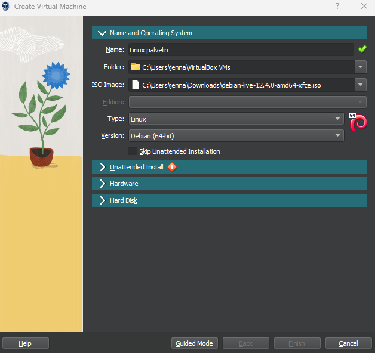
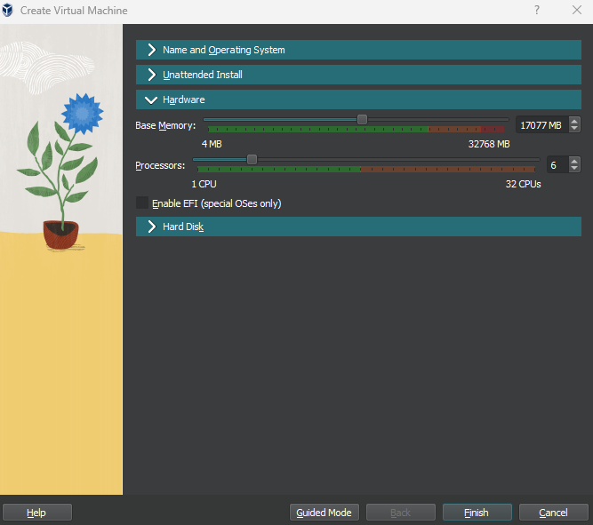
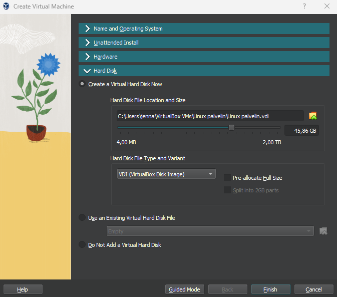
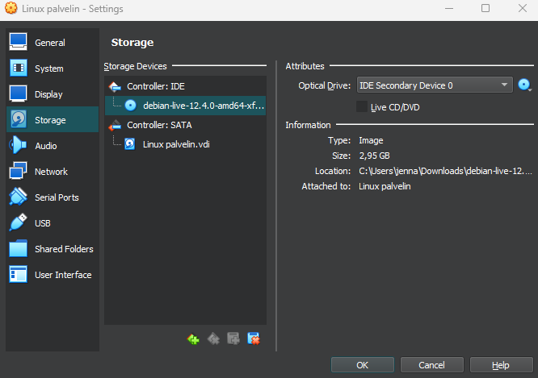
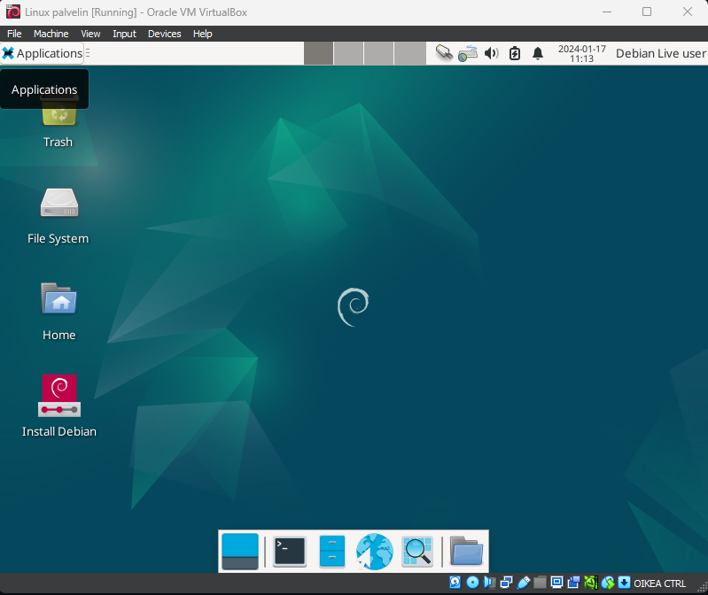
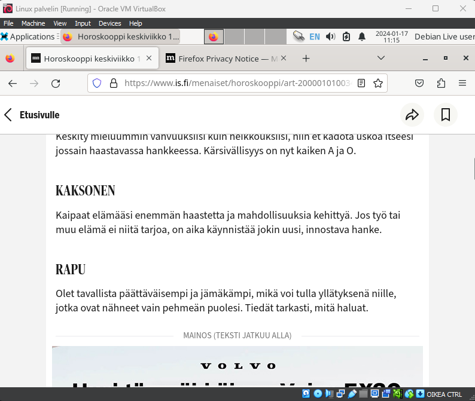
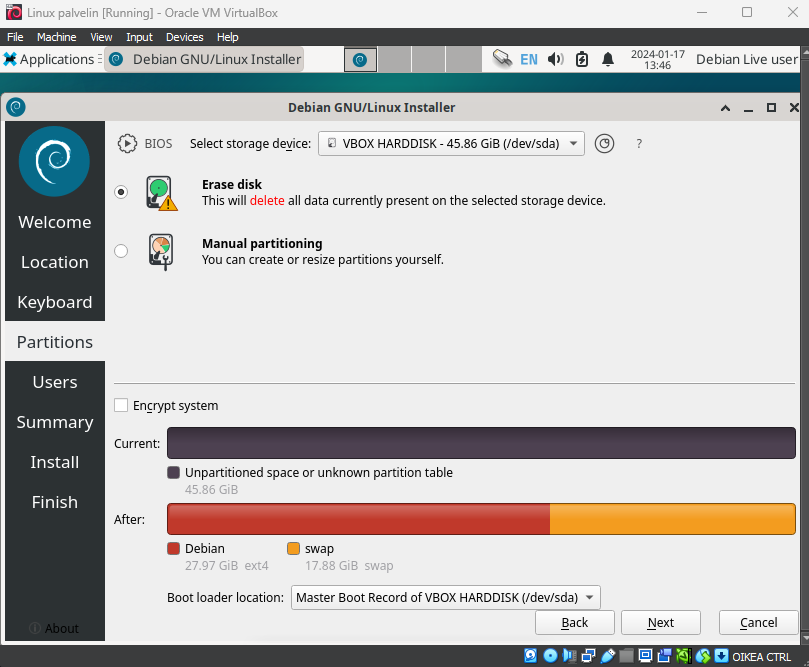
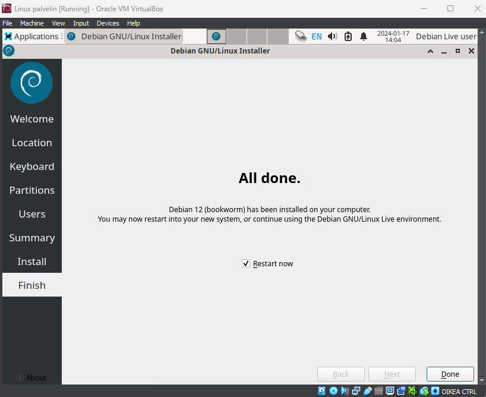
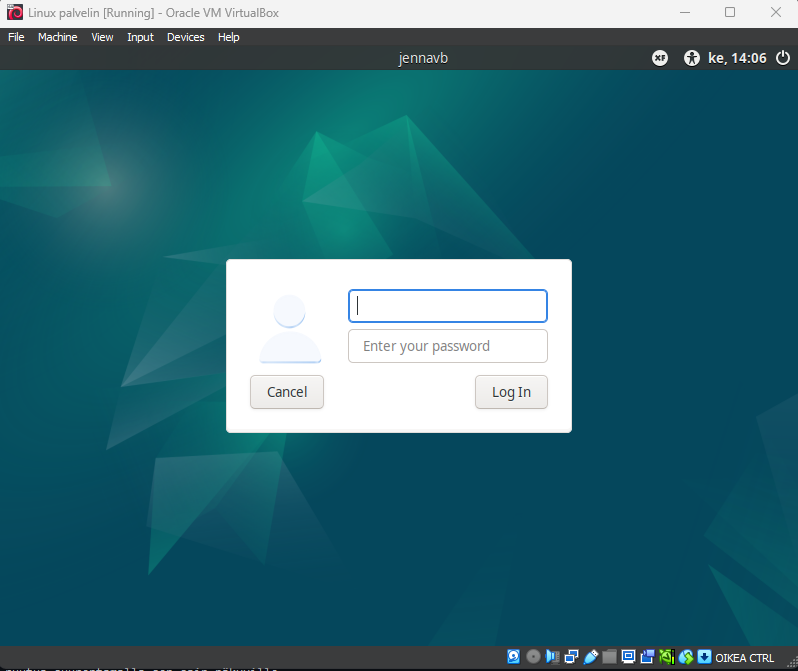

# Oma Linux

## Artikkelit

### Raportin kirjoittaminen
- tekstin tulee olla täsmällinen sekä kertoa mitä on tehty, miten ja mikä on lopputulos
- helppolukuisuus sekä seurattavuus/toistettavuus on tärkeää, lukijan tulee pystyä seuraamaan sekä toistamaan toimenpiteet toimivasti
- viittaa käytettyihin lähteisiin, älä plagioi
- raportin sepittäminen vie lukijan aikaa ja on kiellettyä

### What is Free Software?
- Free Software tarkoittaa vapaata ohjelmistoa
- neljä määriteltyä vapautta ovat ohjelmiston vapaa ajettavuus, lupa tutkia lähdekoodia, muokkaa sitä, kopioida, jakaa muutettuja versioita muille
- vapaa ohjelmisto voi olla kaupallista, kunhan se takaa nämä neljä vapautta

## Linuxin asennus virtuaalikoneeseen

### Asennus

Latasin VirtualBoxin kotona rakennetulle ASUS-merkkiselle koneelle, käytin apuna Tero Karvisen laatimia [ohjeita](https://terokarvinen.com/2021/install-debian-on-virtualbox/).

Asennuksen jälkeen avasin sovelluksen ja klikkasin kohdasta "New", jonka jälkeen ruudulle ilmestyi "Create Virtual Machine" -ikkuna. Heti alkuun vaihdoin näkymän ruudun alareunasta Expert Modeen, tämän jälkeen täytin tiedot.

Huomasin, että "Unattended Install" -kohdassa oli jonkinlainen hälytysmerkki. Asia korjaantui muokkaamalla automaattisesta Hostnamesta välilyönnin pois.
Samasta kohdasta muokkasin käyttäjänimen sekä salasanan.

Siirryin kohtaan "Hardware", jossa lisäsin hieman muistia sekä prosessoreita. 

"Hard Disk" -kohdassa muokkasin kohdan "Hard Disk File Location and Size" kokoa suuremmaksi. Lopulta painoin "Finish" -nappulaa.

VirtualBox Managerista painoin "Settings", josta valitsin "Storage" -kohdan. Klikkasin CD-levyä, jonka kohdalla lukee "Empty". Oikealle reunalle avautuu "Attributes", missä taas painan CD-levyä ja valitsen "debian-live-12.4.0-amd64-xfce-iso" -tiedoston. Tämän jälkeen klikkaan "OK" -näppäintä.

### Käynnistys

Käynnistin Linuxin VirtualBoxista painamalla "Start" -näppäintä. Avautuu "Boot menu", jossa valitsin ensimmäisen "Live system (amd64)" ja painoin Enter. Tämän jälkeen avautui työpöytä. 

Testasin toimivuuden avaamalla selaimen ja lukemalla [Iltasanomien](https://www.is.fi/menaiset/horoskooppi/art-2000010100343.html) sivuilta päivän horoskoopit. 

Työpöydältä valitsin pikakuvakkeen "Install Debian". 
- Welcome: valitsin kieleksi "American English"
- Location: valitsin klikkaamalla Suomea, tai vaihtaa "Region: Europe" ja "Zone: Helsinki"
- Keyboard: valitsin "Generic 105-key PC" sekä "Finnish" ja "default"
- Partitions: valitsin "Erase disk"

- Users: kirjoitin nimeni, muokkasin käyttäjänimeä ja tietokoneen nimeä sekä keksin salasanan

- Summary: tarkistin, että tiedot ovat oikein. Alhaalta painoin "Install". Alkuun nappia ei näkynyt, mutta ruutua suurentamalla sen sain näkyville.
- Finish: asennus onnistui, painoin "Done" -näppäintä, minkä jälkeen ruutu jämähti hetkeksi, mutta heräsi sitten hetken päästä eloon.

  

Ruudulle avautui sisäänkirjautumis kohta. Kirjauduin sisään juuri täyttämilläni tiedoilla ja työpöytä avautui. 

### Lähteet

Karvinen, T. 16.1.2024. Oppitunti. Linux Palvelimet.  
Karvinen, T. 2024. Tehtävänanto. https://terokarvinen.com/2024/linux-palvelimet-2024-alkukevat/#h1-oma-linux. 
Karvinen, T. 2023. Install Debian on Virtualbox - Updated 2023. Tero Karvinen. Luettavissa: https://terokarvinen.com/2021/install-debian-on-virtualbox/. Luettu: 17.1.2024.  
Iltasanomat 2024. Päivän horoskooppi keskiviikkona 17.1. Luettavissa: https://www.is.fi/menaiset/horoskooppi/art-2000010100343.html. Luettu: 17.1.2024.
