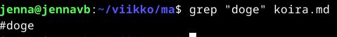
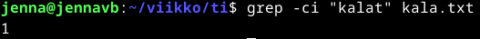
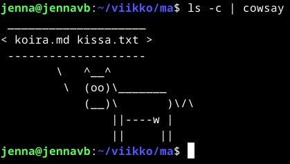
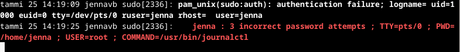
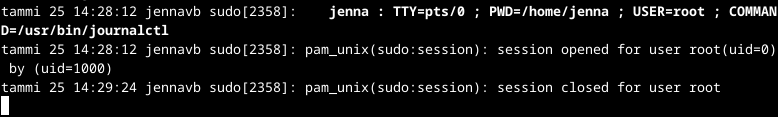

# Komentaja Pinviini

## [Command line basics revisited](https://terokarvinen.com/2020/command-line-basics-revisited/?fromSearch=command%20line%20basics%20revisited)
- Tärkeimpiä liikkumisen komentoja ovat pwd, ls, cd sekä less
- Tiedostojen muokkaamiseen käytetään käytetään pico, nano tai micro
- Hakemistojen/kansioiden käsittelyssä mkdir, mv, cp sekä poistamisessa rmdir, rm (-r)
- SSH:n avaaminen ssh (käyttäjänimi)@(osoite) ja komennolla 'w' näkee muut samalla koneella olevat
- Turvallinen kopiointi koneelta toiselle komennolla scp -r FOLDER(kansion nimi) (käyttäjänimi)@(osoite):(polku etäkoneen kansiosta esim. public_html/)
- Apuja komennolla man ls, history

## Tehtäviä

Käytin asennuksessa avukseni Tero Karvisen laatimia [ohjeita](https://terokarvinen.com/2020/command-line-basics-revisited/?fromSearch=command%20line%20basics%20revisited) sekä [ChatGPT](https://chat.openai.com/) henkisenä tukena.

### Käyttöympäristö

Intel Core i7-13700K, 3.40 GHz, 16 Core Processor   
RAM: 32 Gt   
Windows 11 Pro, versio 23H2   

### Micro-editorin asennus
Aloitin Micro-editorin asennuksen 24.1.2024 klo 13:30.  
Avasin Linux virtuaakoneella sivun https://micro-editor.github.io/ ja latasin sieltä tiedoston micro-2.0.13-linux64.tar.gz.  

Syötin terminaaliin seuraavan komennon:   

    sudo apt-get update

Tämän jälkeen piti kirjoittaa käyttäjätunnuksen salasana.  
Seuraavaksi taisin tehdä virheen syöttämällä komennon:

    apt-cache search micro

Se avasi hyvin pitkän listan erilaisia tiedostoja.  
Päätin seuraavaksi syöttää komennon:

    sudo apt-get -y install micro

Testasin Micron toiminnan:

    micro kala.txt

Sain editorin asennettua noin klo 14:15 ja hyvin näyttää toimivan! 

### Raudan testaus
Aloitin raudan testauksen klo 14:30 syöttämällä terminaaliin komennon:

    sudo lshw -short -sanitize

Piti jälleen syöttää salasana ja sain vastaukseksi 'command not found'.

Asensin lshw:n syöttämällä komennot:

    sudo apt-get update
    sudo apt-get install lshw

Tämän jälkeen syötin syötin uudestaan komennon:

    sudo lshw -short -sanitize

Ruudulle ilmestyi monta riviä tekstiä, jossa näytetään järjestelmän tietoja. 
Osa tiedoista on omasta pöytäkoneestani, mutta kaikkea se ei ole listannut. Esimerkiksi näppäimistö on kuvailussa "AT Translated Set 2 keyboard", eikä omaa näppäimistöä ole listattu. Listassa on paljon virtuaalikoneen omia tietoja, mitkä eivät liity omaan koneeseeni.   

Sain tehtävän tehtyä klo 14:45.

### Kolmen ohjelman asennus
Aloitin ohjelmien latauksen noin klo 15:00.
En tiedä mitään komentoriviohjelmista, joten päädyin kysymään ChatGPT:ltä ehdotuksia. Päätin asentaa htop, grep jka neofetch. Halusin myös testata kaikkien ohjelmien lataamista yhdellä komennolla.

    sudo apt-get update
    sudo apt-get -y install htop grep neofetch

Komento toimi hyvin ja asennukset onnistui.

#### htop
Syötin komennon:

    htop

Ruudulle avautui Teksti-TV:tä muistuttava ruutu, mikä näyttää käynnissä olevat prosessit ja resurssit.

Pois näkymästä pääsin hetkellisen mietinnän jälkeen klikkaamalla 'Quit' kohtaa.

#### grep

Syötin komennon:

    grep -i kalat kala.txt

Kometo avasi kalat sisältävän tekstin.  
(En ole varma kuuluuko sen toimia näin)

#### neofetch

Syötin yksinkertaisen komennon:

    neofetch

Ruudulle avautui hieno kuva ja järjestelmän tiedot.

Saatoin hieman innostua ChatGPT:n ehdotuksesta testata lolcat ohjelmaa, joten latasin sen.  
Syötin komennot:

    sudo apt-get install lolcat
    neofetch | lolcat

Tulokseksi saatiin sama kuva ja tiedot, mutta värikkäänä.

### Kansioiden esittely

Alotin tehtävän klo 15:45.

    ls /

Komento näyttää kaikki kansioit.  

    ls /home/

Näyttää 'jenna' kansion, mikä sisältää omia tiedostoja.

    ls /home/jenna 

Komento avaa 'jenna' kansiossa olevat kansiot. Sisältää omia latauksia sekä muita luotuja tiedostoja.

    ls /etc/

Komento avaa järjestelmän asetuksia.

    ls /etc/console-setup

    ls /media/

Komennolla ei tule mitään, kävin jopa etsimässä kyseisen kansion ja tyhjältä näytti.

    ls /var/log/

Komento avaa järjestelmän lokitiedot

Sain tehtävän tehtyä klo 16:35.

### Lisää greppiä

Aloitin tehtävän 25.1.2024 klo 13:25.  
Ensimmäinen testikomento etsii halutun sanan tiedostosta:

    grep "doge" koira.md

Sain tulokseksi tiedoston sisältämän sanan #doge.

Toinen testikomento laskee montako kertaa haluttu sana on tiedostossa:

    grep -ci "kalat" kala.txt

### Pipe

Alotin tehtävän klo 13:50.  
Testasin ladata cowsay ohjelman sekä listasin grepin avulla kansion tiedostot.  
Syötin komennon: 

    ls -c | cowsay

### Tukki

Alotin tehtävän klo 14:15.
Komento "journalctl -f" näyttää järjestelmän lokitietoja.   
Alkuun testasin epäonnistunutta toimenpidettä syöttämällä komennon, jonka avulla seurataan myös lokitietoja:

    sudo journalctl

Tässä kohtaan kysyttiin salasanaa, jonka kirjoitin kolme kertaa väärin. Tämän jälkeen menin tarkistamaan reaaliaikaisia lokitietoja, missä olikin kirjattu epäonnistunut salasanansyöttö.

Syötin uudestaan "sudo journalctl" ja kirjoitin salasanan oikein. Reaaliaikaisten lokitietoja tarkastellessa näin onnistuneen salasanansyötön.

Sain tehtävät tehtyä klo 14:35.

## Lähteet
Karvinen, T. 16.1.2024. Oppitunti. Linux Palvelimet.  
Karvinen, T. 2024. Tehtävänanto. https://terokarvinen.com/2024/linux-palvelimet-2024-alkukevat/#h2-komentaja-pingviini.  
Karvinen, T. 2020. Command Line Basics Revisited. https://terokarvinen.com/2020/command-line-basics-revisited/?fromSearch=command%20line%20basics%20revisited.  
OpenAI. ChatGPT. Versio 3.5. 2024. https://chat.openai.com/chat.  
Linux. 2024. Komentorivin perusteet. https://www.linux.fi/wiki/Komentorivin_perusteet.   

