# Hello Web Server

## Artikkelit

### [Name-based Virtual Host Support](https://httpd.apache.org/docs/2.4/vhosts/name-based.html)
-  IP-pohjaiset palvelimet tarvitsevat erilliset IP-osoitteet, kun taas nimiin perustuvat palvelimet voivat ilmoittamalla hostnamen ja HTTP headerin jakaa saman IP-osoitteen
-  nimeen perustuvan palvelimen valinnassa palvelin etsii parhaiten sopivan `<VirtualHost>` argumentin IP-osoitteen ja portin perusteella
-  `<VirtualHost>` lohko tulee sisältää: Servername, ServerAlias, DocumentRoot sekä hakemistopolun (Directory)

### [Name Based Virtual Hosts on Apache - Multiple Websites to Single IP Address](https://terokarvinen.com/2018/04/10/name-based-virtual-hosts-on-apache-multiple-websites-to-single-ip-address/)
- Apachen avulla yhdellä IP-osoitteella voi luoda monia verkkotunnuksia (domain names)
- nimeen perustuvan palvelimen luonnissa käytetään `sudo` komentoa
- palvelimen luonnin jälkeen se testataan `curl` komennolla

## Tehtäviä

Käytin palvelimen luomiessa avukseni Tero Karvisen laatimia [ohjeita](https://terokarvinen.com/2018/04/10/name-based-virtual-hosts-on-apache-multiple-websites-to-single-ip-address/) sekä [ChatGPT](https://chat.openai.com/) henkisenä tukena.  

Aloitin tehtävien teon 31.1.2024 klo 11:50. Aktivoin default-sivun komennolla `$ sudo a2ensite 000-default.conf` ja otin muutoksen käyttöön `$ sudo systemctl restart apache2` sekä poistin "vanhan" localhost sivun komennolla `$ sudo rm /etc/apache2/sites-enabled/jenna.example.com.conf`.  

### Käyttöympäristö

Intel Core i7-13700K, 3.40 GHz, 16 Core Processor  
RAM: 32 Gt  
Windows 11 Pro, versio 23H2  

### Localhost testaus

Apache-weppipalvelin on jo asenettuna tälle VirtualBoxille. Testasin weppipalvelimen toimivuuden Firefox-selaimella syöttämällä osoitteen http://localhost. Hyvin näyttää toimivan!

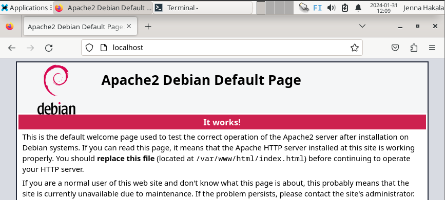

### Lokin tutkiminen
Klo 12:19 syötin komennon `$ sudo tail -1 /var/log/apache2/access.log`, joka avasi viimeisimmän lokitapahtuman. Syötin myöhemmin myös komennon `$ tail -f /var/log/apache2/access.log`, joka näyttää lokitietoja reaaliaikaisesti.

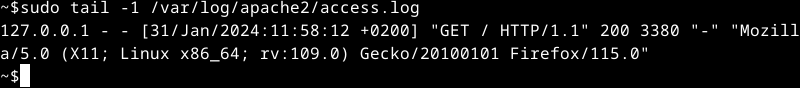

127.0.0.1 on localhost IP-osoite.  
Yleensä tämän jälkeen on todennettun HTTP-käyttäjän tiedot, mutta tässä se on merkattu -.  
Seuraavaksi löytyy päivämäärä ja aika, jolloin palvelin on ladattu.  
GET on tyyppi ja HTTP sekä protokollan versio.    
200 on Apachen koodi onnistuneelle tapahtumalle.  
3380 on vastauksen koko tavuina.  
"-" kohdassa on mahdollinen url, jos sellainen käytössä.  
Lopussa on user agent, joka kertoo käytetyn selaimen sekä käyttöjärjestelmän tiedot.  

Sain lokitiedot tutkittua klo 12:49.  

### Etusivu uusiksi

Syötin klo 13:04 komennon `$ sudoedit /etc/apache2/sites-available/hattu.example.com.conf`, joka avasi oletuseditoriksi aiemmin muokkaamani micro-editorin.  
Lisäsin micro-editoriin `<VirtualHost>` tiedot.

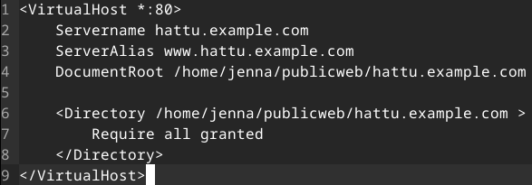

Klo 13:24 syötin komennot `$ sudo a2ensite hattu.example.com` ja otin muutokset käyttöön `$ sudo systemctl restart apache2`.  
Klo 13:29 siirryin aiemmin luomaani publicweb hakemistoon ja loin sinne uuden hakemiston komennolla `$ mkdir hattu.example.com`.   
Tämän hakemiston sisään loin HTML-tiedoston `$ micro index.html`, kirjoitin tiedostoon testiksi kaksi sanaa. 

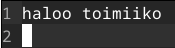

Klo 13:43 poistin default-sivun sites-enabled hakemistosta komennolla `$ sudo rm /etc/apache2/sites-enabled/000-default.conf` ja otin muutokset käyttöön `$ sudo systemctl restart apache2`.  

Kävin muokkaamassa `hattu.example.com` hakemistossa sijaitsevaa `index.html` tiedostoa.  Lisäsin hattu.example.com `<title>` ja `<h1>` kohtiin.  Jonka jälkeen selaimessa näytti siltä, miltä pitääkin.  

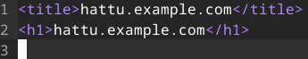  

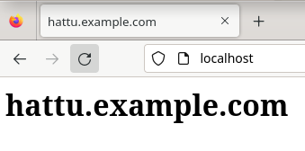

Sain tämän valmiiksi klo 14:02.

### HTML5 sivu
Klo 14:26 alotin muokkaamaan `index.html` tiedostoa.  Kirjoitin sinne lyhyen HTML5 tekstin, mikä meni [Validatorista](https://validator.w3.org/#validate_by_input) läpi.  

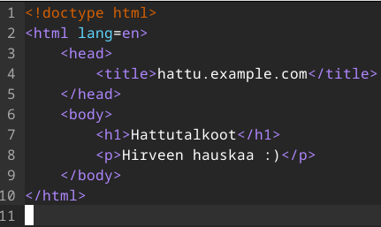

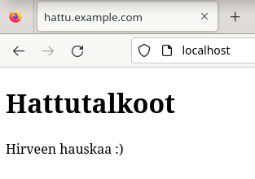

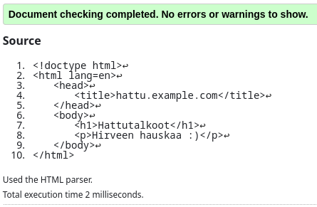

### Curl-testaus

Klo 14:38 syötin komennon `curl localhost`, sain näkyville tämänhetkisen localhostin `index.html` tiedoston.  

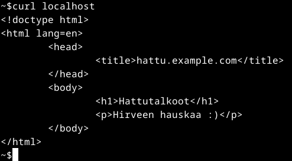

Tämän jälkeen syötin komennon `curl -i localhost`, mikä näyttää enemmän localhost tietoja.  

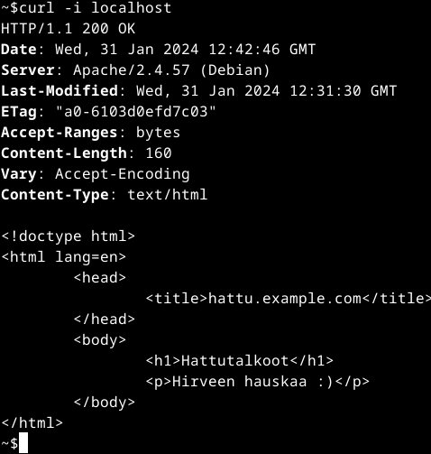

HTTP/1.1 näyttää protokollan ja sen version.  
200 on Apachen koodi onnistuneelle tapahtumalle. 
Date kertoo, milloin tiedot on lähtenyt palvelimelta.  
Server kertoo palvelimen ohjelmiston.  
Last-Modified, milloin viimeksi palvelinta on muokattu.  
ETag yksilöi tietyn resurssiversion.  
Accept-Ranges kertoo tukevansa osittaista tiedonsiirtoa, tässä tapauksessa tavujen osalta.  
Concept-Length näyttää sisällön pituuden tavuina.  
Vary kertoo mitkä pyynnön osat ovat vaikuttaneet vastauksen sisältöön.  
Content-Type kertoo sisällön tyypin.  

Sain tehtävän tehtyä klo 15:22.  

### Github Education

Pistin hakemuksen [Github Educationiin](https://education.github.com/).

## Lähteet

Karvinen, T. 30.1.2024. Oppitunti. Linux Palvelimet.  
Karvinen, T. 2024. Tehtävänanto. https://terokarvinen.com/2024/linux-palvelimet-2024-alkukevat/#h3-hello-web-server.  
Karvinen, T. 10.4.2018. Name Based Virtual Hosts on Apache – Multiple Websites to Single IP Address. https://terokarvinen.com/2018/04/10/name-based-virtual-hosts-on-apache-multiple-websites-to-single-ip-address/.  
The Apache Software Foundation. 2023. Apache HTTP Server Version 2.4. Name-based Virtual Host Support. https://httpd.apache.org/docs/2.4/vhosts/name-based.html.  
OpenAI. ChatGPT. Versio 3.5. 2024. https://chat.openai.com/chat.  
EasyEngine. s.a. Parsing access.log and error.logs using linux commands. https://easyengine.io/tutorials/nginx/log-parsing/.  
InMotion Hosting. 16.8.2021. Apache Codes. https://www.inmotionhosting.com/support/server/apache/apache-codes/.  
MDN Wed Docs. 2023. HTTP. https://developer.mozilla.org/en-US/docs/Web/HTTP. 
