# Maailma kuulee

## Artikkelit
### [Teoriasta käytäntöön pilvipalvelimen avulla](https://susannalehto.fi/2022/teoriasta-kaytantoon-pilvipalvelimen-avulla-h4/)
- GitHub Educationin paketin avulla saa DigitalOceanin ja Namecheapin palveluja testiin
- Palomuurin konfigurointi tärkeää palvelimen suojaamiseksi
- Virtuaalipalvelimelle luodaan uusi käyttäjä, jolle annetan pääkäyttäjän oikeudet
- Tietoturvapäivitysten sekä muidenkin päivitysten ajantasaisuus tärkeää turvallisuuden kannalta

### [First Steps on a New Virtual Private Server – an Example on DigitalOcean and Ubuntu 16.04 LTS](https://terokarvinen.com/2017/first-steps-on-a-new-virtual-private-server-an-example-on-digitalocean/)
- Ikinä ei saa käyttää huonoa salasanaa, edes hetkellisesti
- Palomuuriin tulee tehdä SSH portille reikä komennolla `$ sudo ufw allow 22/tcp` ja hyväksyä se `$ sudo ufw enable`, ennen sen käynnistämistä
- Sudo-käyttäjän luonnin jälkeen tule kokeilla sillä sisäänkirjautumista ennen root-istunnon sulkemista
- Root-tili lukitaan komennolla `$ sudo usermod --lock root` turvallisuuden takia
- Esimerkiksi Apachen asennuksessa, tulee avata tarvittavat portit palomuurista

## Tehtäviä

Käytin asennuksessa avukseni Tero Karvisen laatimia [ohjeita](https://terokarvinen.com/2017/first-steps-on-a-new-virtual-private-server-an-example-on-digitalocean/), Susanna Lehdon [raporttia](https://susannalehto.fi/2022/teoriasta-kaytantoon-pilvipalvelimen-avulla-h4/) sekä [ChatGPT](https://chat.openai.com/) henkisenä tukena.

### Käyttöympäristö

Intel Core i7-13700K, 3.40 GHz, 16 Core Processor   
RAM: 32 Gt   
Windows 11 Pro, versio 23H2  
Debian 12 Bookworm

### Virtuaalipalvelimen vuokraus
Aloitin virtuaalipalvelimen vuokrauksen tutkimisen klo 11:43. Päädyin käyttämään [GitHub Educationin](https://education.github.com/) GitHub Student Developer Packkia ja sen tarjoamia kokeiluja [DigitalOceaniin](https://www.digitalocean.com/) ja [Namecheappiin](https://www.namecheap.com/). Myöhemmin Namecheap vaihtui [Name.comiin](https://www.name.com/).  

Menin DigitalOceanin sivuille ja rekisteröidyin käyttäjäksi GitHubin kautta. Sivu pyysi todentamaan henkilöllisyyteni luottokorttitietojen avulla ja todennusprosessin aikana kortiltani veloitettiin yksi euro, mikä kuitenkin palautui katevarauksista takaisin. Todentamisen jälkeen minut ohjattiin etusivulle.

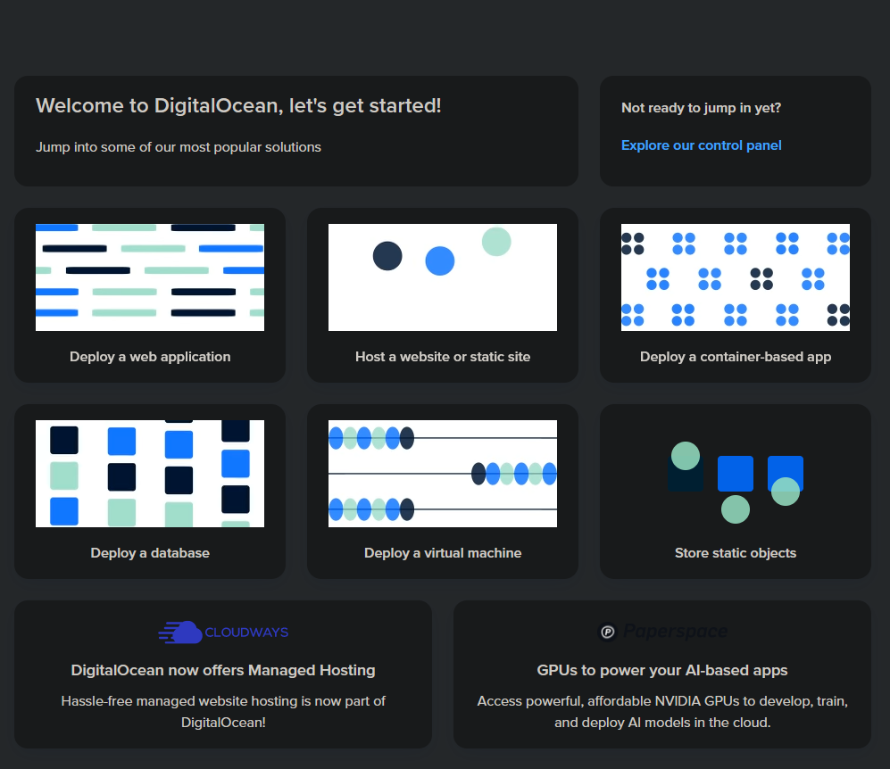

Tämän jälkeen kilikkasin `Explore our control panel` -linkkiä.
Valitsin vasemman reunan valikosta `Billig` -kohdan ja löysi `Promos` -kohdan, mutta en GitHubista mitään promokoodia. Päädyin googlettamaan hakusanalla "how to use github education digitalocean promo", jonka avulla löysin linkin tähän tarkoitukseen.   

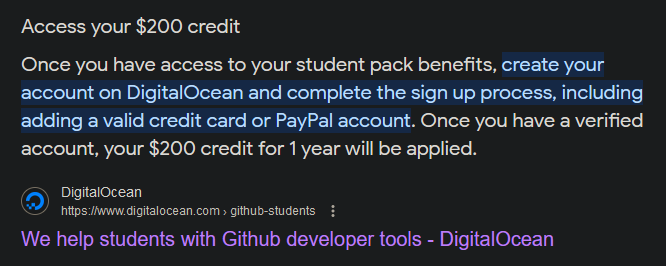
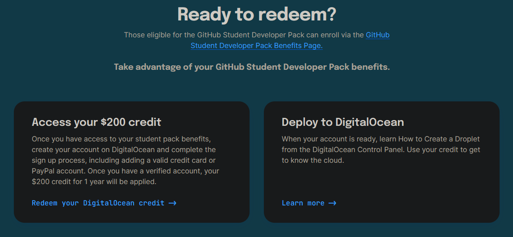

Painamalla `Redeem your DigitalOcean credit`, minun piti uudestaan todentaa GitHub käyttäjätunnus. 

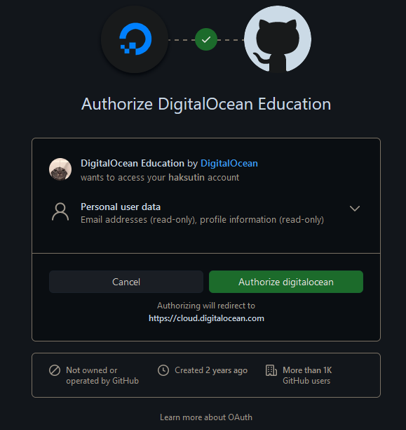

Tämän jälkeen `Credits` kohtaan oli ilmestynyt GitHubin lupaama $200.  

Susanna Lehdon vinkistä kävin vielä laittamassa varmuuden vuoksi maksuhälytykset päälle välttääkseni mahdolliset ylimääräiset/turhat maksut kurssin jälkeen.   

`Billing -> Settings -> Billing Alert -> Enable Alert -> $4 -> Confirm`  

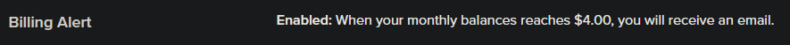

Aloitin virtuaalipalvelimen luomisen klikkaamalla vasemmalla olevasta valikosta `Droplets`ja sieltä `Create Droplet`.  Sitten olikin valintojen aika.  

Alueeksi valitsin mahdollisimman lähellä olevan -> Amsterdam.

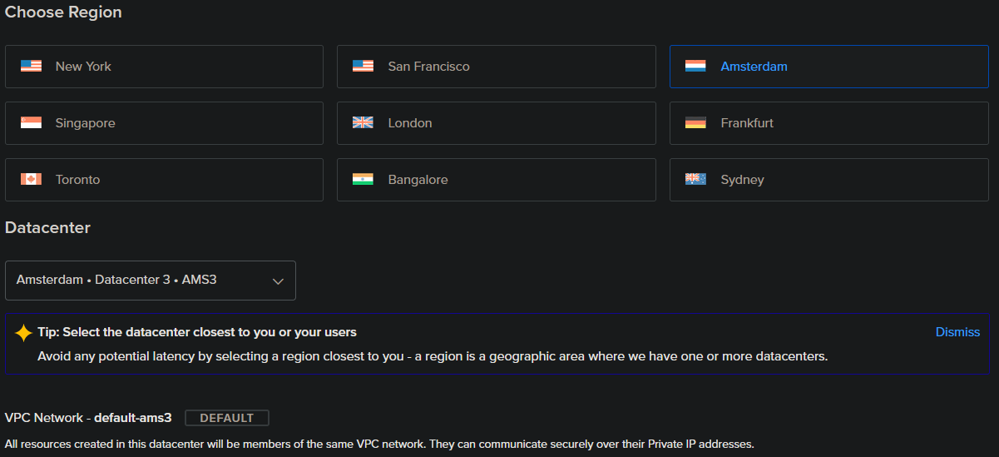

Käyttöjärjestelmäksi valitsin `Debian`ja versioksi `12 x64`.

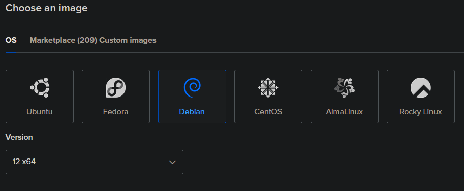

Droplet typeksi valitsin `Basic` ja CPU `Regular` sekä `1 GB` muistia.

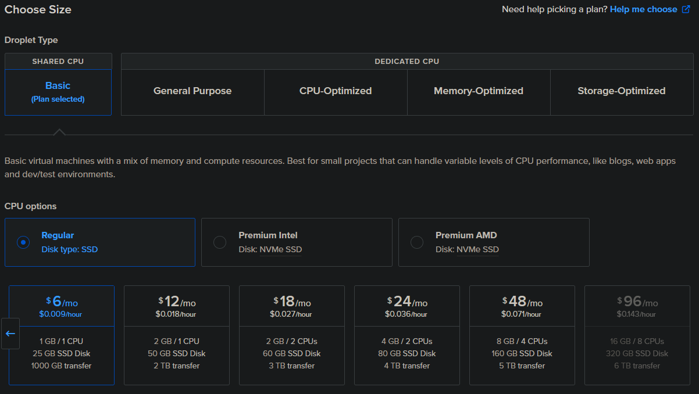

Autentikointimenetelmäksi valitsin salasanan. 

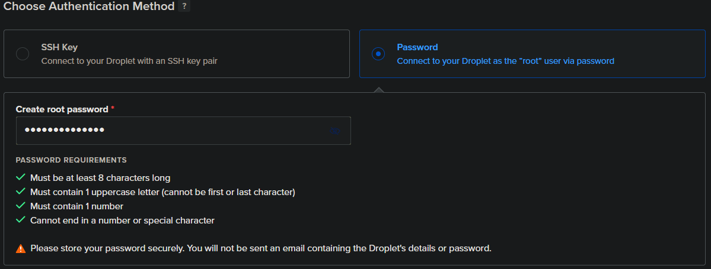

Valitsin Droplettien määräksi `yhden` ja hostnameksi laitoin `debian`.

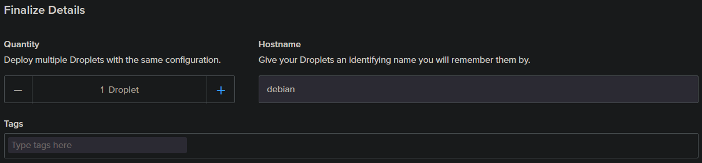

Muita asetuksia en tehnyt/muuttanut. Tämän jälkeen painoin nappia `Create Droplet`.

Hetki meni ja virtuaalikone oli valmis sekä sain kyseisen koneen ip-osoitteen.

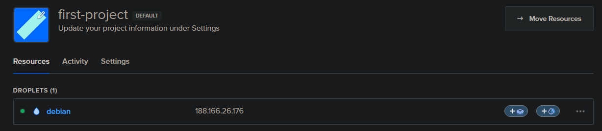

### Domain-nimen vuokraus

Seuraavaksi siirryin Namecheapin sivuille ja yritin löytää sieltä, miten GitHub Educationin etu käytetään. Päädyin taas googlettamaan asiasta ja pääsin jonkinaliselle sivulle, josta sain linkin namecheapin `Claim your free domain` -sivulle.  


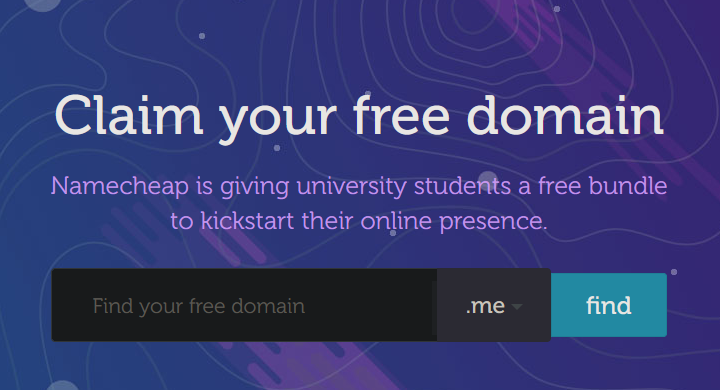

Kirjoitin kenttään haluamani domainnimen `jennamaria`. Tämä olikin vapaana, joten klikkasin `add` -nappia sen ja sen jälkeen `Complete order`.

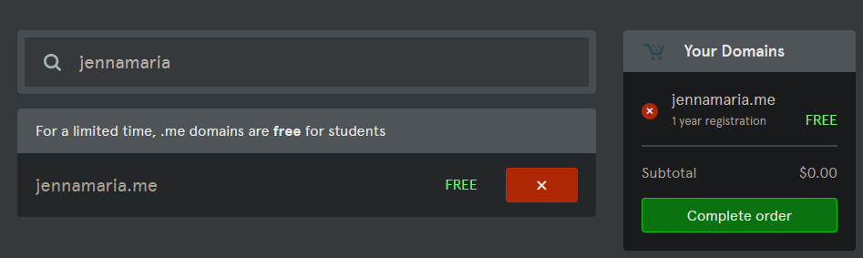

Tämän jälkeen valitsin `GitHub Pages` -kohdan, jotta saisin domainnimen ilmaiseksi GitHub Educationin kautta. Syötin opiskelijasähköpostiosoitteeni myös alempaan kenttään ja klikkasin `Finish Up`. 

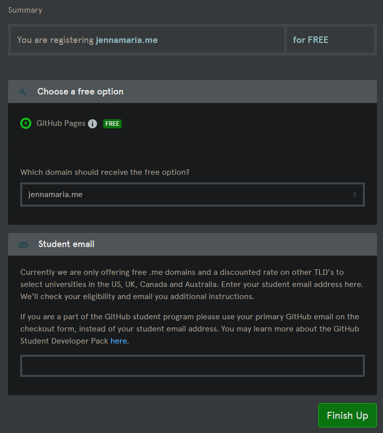

Sähköposti ei käynyt, joten päädyin takaisin namecheapin etusivulle ja rekisteröidyin käyttäjäksi omalla sähköpostillani. Se onnistui, mutta en löytänyt mitään millä yhdistäisi GitHubiin tai saisi etua käyttöön.   

Luovutin Namecheapin kanssa ja siirryin [Name.comiin](https://www.name.com/).   
Pistin googleen taas "name.com github student" -haun ja klikkasin [Signing up for GitHub Student Developer Pack](https://www.name.com/support/articles/360036364834-signing-up-for-github-student-developer-pack). Seurasin sivun ohjeita ja pääsin todentamaan GitHub -tunnuksen. 

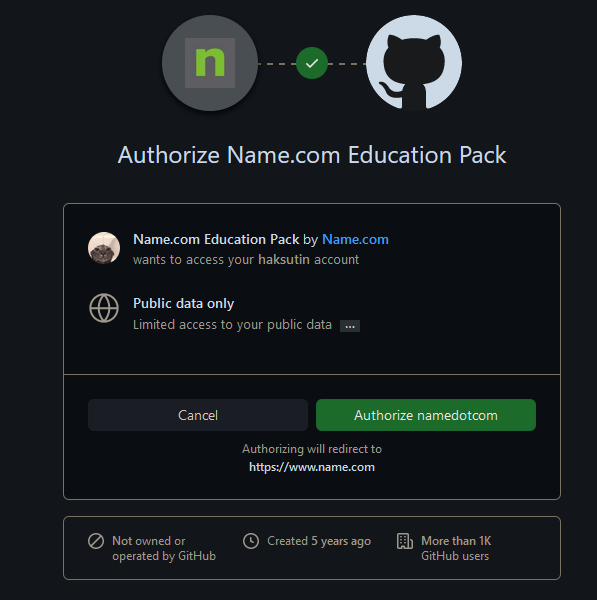

Pääsin uudestaan hakemaan domainnimeä ja hain taas samaa kuin aikaisemminkin. Lisäsin ostoskoriin domainnimen `.live` päätteellä, sillä muita "järkevän" kuulosia ei ollut valittavana.

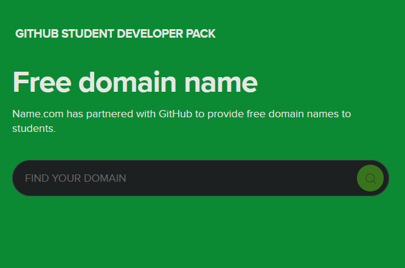

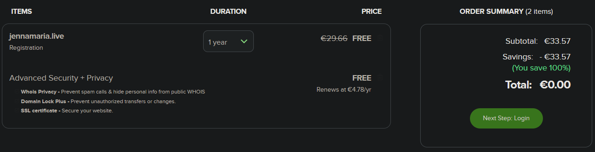

Tämän jälkeen klikkasin `Next Step: Login`-nappia. Rekisteröidyin käyttäjäksi ja päädyin takaisin ostoskoriin, mutta nappi oli muuttunut `Next Step: Payment`, klikkasin sitä. Täytin vaaditut maksutiedot ja hyväksyin tilauksen. 

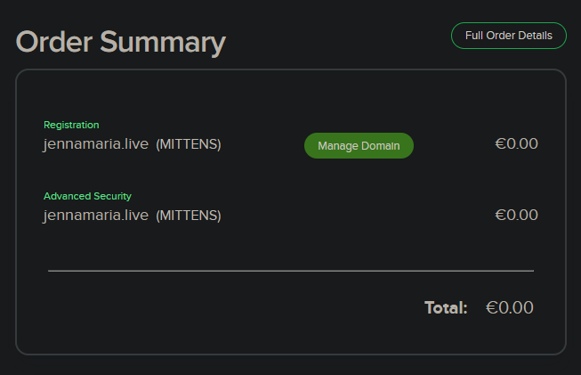

Lopuksi piti yhdistää domainnimi ja DigitalOceanista hankittu virtuaalipalvelin. Käytin tässä apuna Susanna Lehdon raporttia ja Teron vinkkejä.  
Sivu oli erilainen ja yritin mukailla ohjeita parhaani mukaan. Täytin hostiksi `www`, answeriksi DigitalOceanilta saadun IP-osoitteen ja TTL `300`, vaikka ojeissa suositeltiin 5min - 4h. Tällä sivulla minimi oli 300.  
EDIT. poistin host-kohdasta `www`. Älysin myös, että TTL 300 tarkoittikin tällä sivulla sekunteja, jolloin ohjeistettu 5min onnistui hyvin.

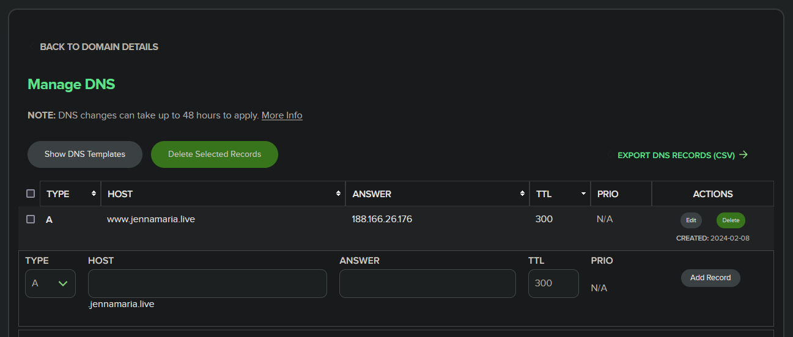

Sain kaiken tehtyä ongelmien ja lyhyen tauon kanssa klo 15:45.

### Virtuaalipalvelimen alkutoimet
Klo 15:54 siirrtyin VirtualBoxin kautta Linuxille ja avasin Terminalin.  
Asensin SSH syöttämällä seuraavat komennot:

    $ sudo apt update
    $ sudo apt install ssh
    $ sudo systemctl start ssh
    
Tämän jälkeen syötin komennon `$ ssh root@188.166.26.176`. 
Tällöin tuli kysymys haluanko jatkaa yhteydenottoa, vastasin kyllä. Tämän jälkeen yhteys suljettiin. Syötin saman komennon uudestaan ja kysytiin salasanaa, syötin saman salasanan kuin DigitalOceanin sivuilla.

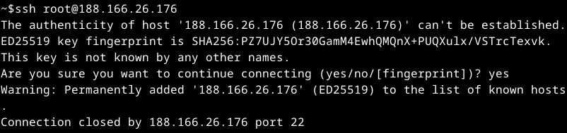

Syötin komennon `$ sudo apt-get update`.

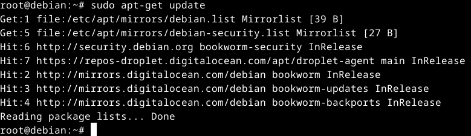

Seuraavaksi oli vuorossa palomuurin asennus komennolla `$ sudo apt-get install ufw`.  
Tämän jälkeen tein palomuuriin reiän porttia varten sekä laitoin palomuurin päälle. Syötin seuraavat komennot:

    $ sudo ufw allow 22/tcp
    $ sudo ufw allow 80/tcp
    $ sudo ufw enable

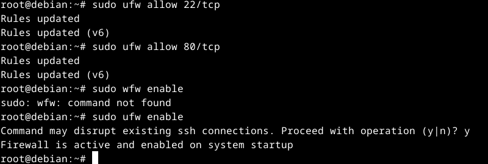

Sain nämä tehtyä klo 16:50.

### Weppipalvelimen asennus
Aloitin klo 17:25 luomalla käyttäjän komennolla `$ sudo adduser jensku`.  
Syötin käyttäjälle salasanan ja täytin tiedoista vain koko nimen.

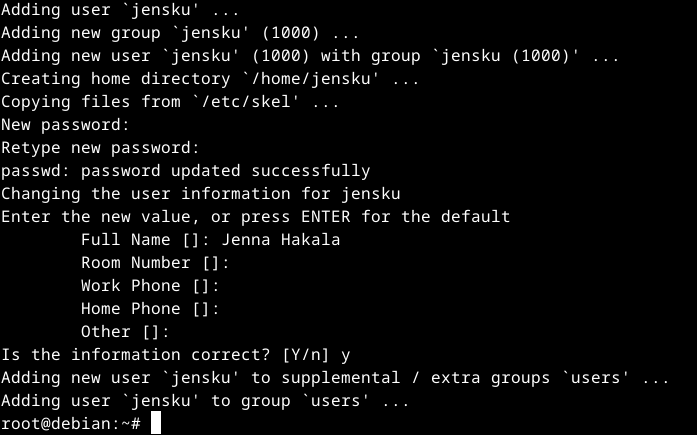

Syötin komennon `$ sudo adduser jensku sudo`, jotta sain käyttäjälle pääkäyttäjän oikeudet.  
Testasin toimivuuden toisella terminaalilla syöttämällä komennon `$ ssh jensku@188.166.26.176` ja `$ sudo apt-get update`, hyvin toimi.

Seuraavaksi lukitsin rootin komennolla `$ sudo usermod --lock root` sekä `$ sudo service ssh restart`.  
Koitin tämän jälkeen kirjautua uudestaan roottiin, mikä toimi lukitsemisen jälkeenkin.  
Tähän myöhemmin palauduttua ojarv kanssa, syötin komennon `$ sudoedit /etc/ssh/sshd_config` ja muokkasin kohdan `PermitRootLogin` yes -> no.  
Tämän jälkeen vielä komento `$ sudo service ssh restart`.

Tämän jälkeen hämmennyin ja kyselin neuvoa kurssilaiselta ojarv. Keskustelimme Discord-puhelussa ja lopusta raportista saattoi kadota komentohistoriat. Selitän kaiken mahdollisimman tarkasti.

Loin polun  `/home/jensku/jennamaria.live/` ja syötin komennon  ` micro index.html`. Tiedostoon lisäsin yhden sanan testiksi, minkä myöhemmin kunnolliseksi.  
Valmiin HTML-pohjan sain ojarv luvalla hänen [GitHubista](https://github.com/ojarv).

```
<!DOCTYPE html>
<html lang="fi">
<head>
        <meta charset="utf-8">
        <title>Huppista</title>
</head>

<body>
        <h1>Moikkuli<3</h1>
        <p>Hellurei vaa kaikille</p>
</body>
</html>
```

Sekä siirrtyin hakemistoon `/etc/apache2/sites-available/` ja loin VirtualHost -tiedoston komennolla `sudoedit jennamaria.live.conf`.

```
<VirtualHost *:80>
        ServerName jennamaria.live
        ServerAlias www.jennamaria.live
        DocumentRoot /home/jensku/jennamaria.live/
        <Directory /home/jensku/jennamaria.live/>
                Require all granted
        </Directory>
</VirtualHost>
```

Tässä kohtaa kansioiden sekä `index.html`-tiedoston käyttöoikeuksien kanssa oli ongelmia, mutta saimme ne ratkaistua. Komennot valitettavasti kerkesi kadota. 

Lopussa vielä päivitin virtuaalipalvelimen ohjelmat komennolla `$ sudo apt-get upgrade`.  

Tässä vielä lopputuloksesta ja sen toimivuudesta kuva sekä linkki [jennamaria.live](http://jennamaria.live/).

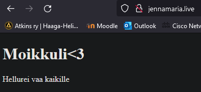


Aikaa meni tähän tehtävään suhteellisen paljon kaikkien ongelmien kanssa ja sain kaiken tehtyä klo 19:15 ja raportin muokattua klo 19:52.

### Virheiden korjauksia

24.2.2024 klo 7:20 aloitin korjaamaan virheitä, mitä olin aikasemmin huomannut HTML-tiedostossa. Olin jollain tavalla onnistunut rootin lukitsemisessa lukitsemaan myös `jensku@188.166.26.176` käyttäjän, enkä päässyt muokkaamaan HTML-pohjaa.   
Kävin poistamassa DigitalOceanista dropletin ja tein samalla tavalla uuden, jolloin sain myös uuden ip-osoitteen `167.99.37.97`. Kävin muokkaamassa ip-osoitteen tiedot myös name.comiin.  

Siirryin Windowsin PowerShelliin ja syötin samat komennot kuin aikaisemmin.  
Kirjauduin roottiin komennolla `$ ssh root@167.99.37.97`.  
Asensin palomuurin ja tein reiät tarvittaville porteille.  
Loin käyttäjän `jensku` ja annoin oikeudet komennoilla:

    $ sudo adduser jensku sudo
    $ sudo adduser jenksu adm

Lukitsin rootin.  
Syötin komennot:

    $ sudo apt-get update
    $ sudo apt-get upgrade

Asensin apachen ja testasin palvelimen tilan.  

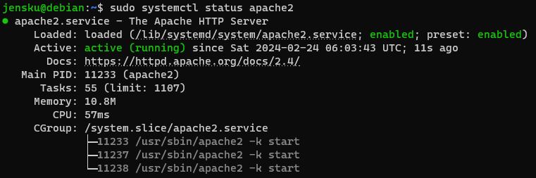

Kirjasin `<VirtualHost>` -tiedot ja loin HTML-sivun.

Jämähdin klo 8:45 taas oikeuksien hallintaan, sillä en muista tai löytänyt oikeaa chmod käskyä.

Klo 14:30 jatkoin ojarv vinkkauksen kanssa.

Syötin komennon `$ sudo chmod +x /home/jensku` ja sivu alkoi heti toimimaan.  
Joten loppu hyvin kaikki hyvin.

## Lähteet
Karvinen, T. 6.2.2024. Oppitunti. Linux Palvelimet.  
Karvinen, T. 2024. Tehtävänanto. https://terokarvinen.com/2024/linux-palvelimet-2024-alkukevat/#h4-maailma-kuulee.  
Karvinen, T. 19.9.2017. First Steps on a New Virtual Private Server – an Example on DigitalOcean and Ubuntu 16.04 LTS. https://terokarvinen.com/2017/first-steps-on-a-new-virtual-private-server-an-example-on-digitalocean/.  
Lehto, S. 14.2.2022. Teoriasta käytäntöön pilvipalvelimen avulla (h4). https://susannalehto.fi/2022/teoriasta-kaytantoon-pilvipalvelimen-avulla-h4/.  
OpenAI. ChatGPT. Versio 3.5. 2024. https://chat.openai.com/chat.  
Ojarv. 2024. https://github.com/ojarv/. Discord-puhelu.   
