# Koko juttu

## Tehtäviä

Käytin tehtävää tehdessä avukseni aikaisempia [raporttejani](https://github.com/haksutin/linux-server) sekä [ChatGPT](https://chat.openai.com/) henkisenä tukena.

### Käyttöympäristö

Intel Core i7-13700K, 3.40 GHz, 16 Core Processor   
RAM: 32 Gt   
Windows 11 Pro, versio 23H2  
Debian 12 Bookworm

### Virtuaalikoneen asennus

Aloitin virtuaalikoneen asennuksen 14.2.2024 klo 9:08.  
Avasin Oracle VM VirtualBoxin ja klikkasin kohtaa "New", minkä jälkeen avautui "Create Virtual Machine" -ikkuna.  
Vaihdoin näkymän alareunasta Expert modeen ja täytin tarvittavat tiedot sekä korjasin aiemmalla kerralla tekemäni virheen klikkaamalla "Skip Unattended Install".  

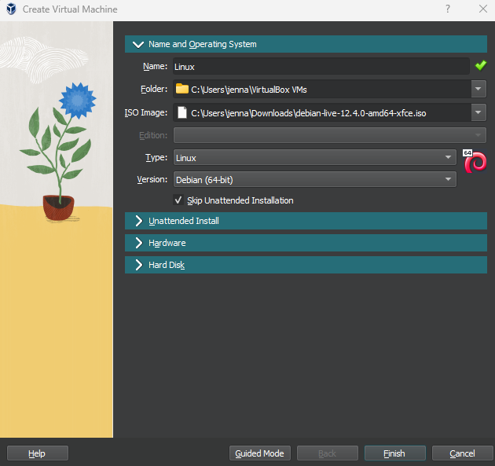

Siirryin kohtaan "Hardware" ja lisäsin muistia ja prosessoreita.

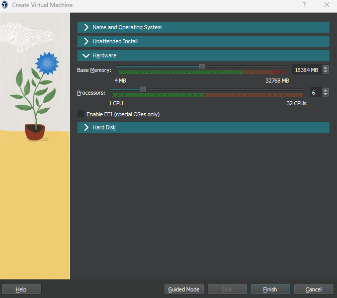

Seuraavaksi siirryin kohtaan "Hard Disk" ja muokkasin kohtaa "Hard Disk File Location and Size" suuremmaksi.  
Tämän jälkeen painoin "Finish" -nappia.  

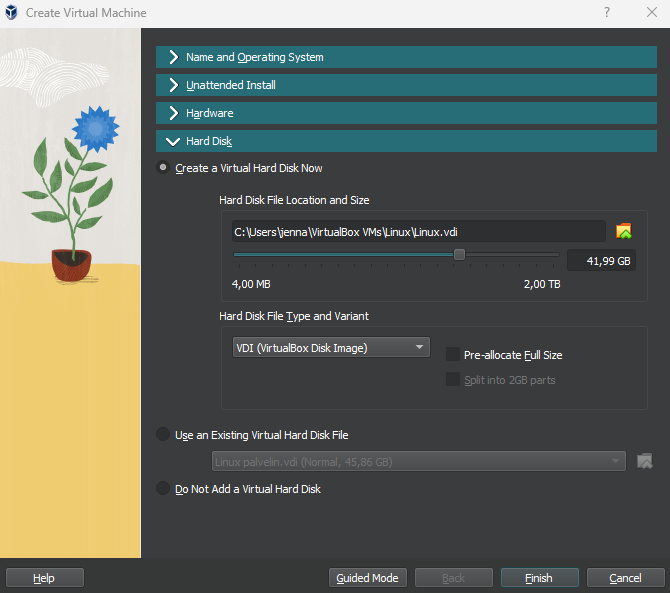

Siirryin VirtualBox Manageriin ja valitsin "Settings", josta siirryin "Storage" -kohtaan.  
Klikkasin CD-levyä, jonka kohdalla lukee "Empty". Tämän jälkeen oikealle reunalle avautui "Attributes", jossa painoin CD-levyä ja valitsin "debian-live-12.4.0-amd64-xfce-iso" -tiedoston.   
Tämän jälkeen hyväksyin muutokset painamalla "OK" -näppäintä.  

 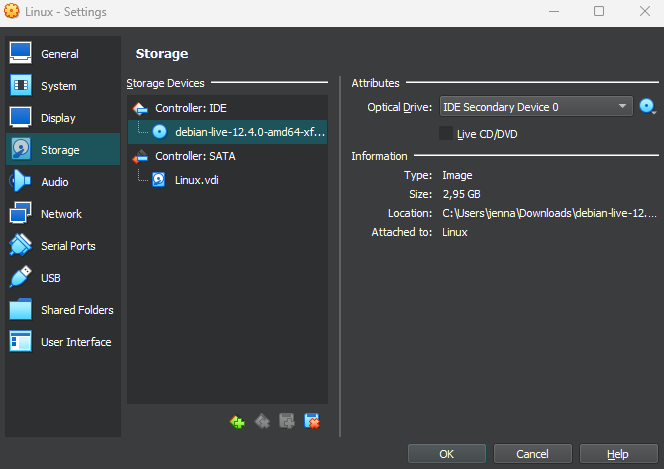

Tämän jälkeen käynnistin virtuaalikonen. Alussa avautui "Boot menu", josta valitsin "Live system (amd64)" painamalla Enter.  
Heti alkuun testasin selaimen toimivuuden.  

Klikkasin työpöydällä olevaa "Install Debian" -kuvaketta ja ruudulle pomppasi huomio ruutu, jossa kysytään haluanko jatkaa, klikkasin "Launch Anyway".  

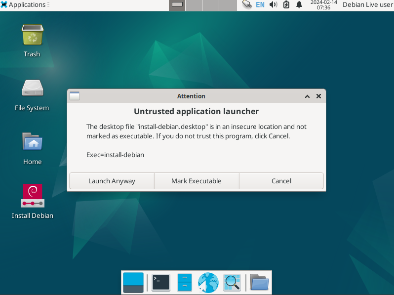

Debian installerissa tein seuraavat valinnat:

- Welcome: `American English`
- Location: Region: `Europe` ja Zone: `Helsinki`, valinnan voi myös tehdä klikkaamalla Suomea kartalta
- Keyboard:  Keyboard Model: `Generic 105-key PC` sekä `Finnish` ja `Default`
- Partitions: `Erase disk`

Users kohdassa täytin kaikki kohdat.  

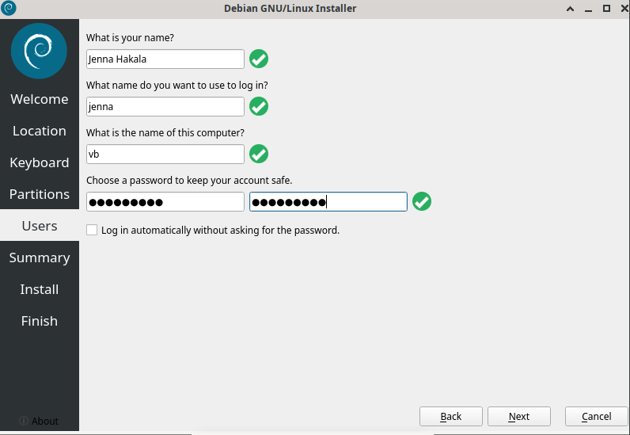

Summary kohdassa tarkistin vielä, että valinnat on oikein ja hyväksyin ne klikkamalla "Install" -nappia. Nappi ei ollut näkyvissä, mutta suurentamalla ruutua oikeasta yläreunasta se tulee näkyville.  

Tämän jälkeen tietoja päiviteltiin ja latauksen jälkeen ruutu siirtyi "Finish" -kohtaan, jossa oli teksti "All done.". Jätin "Restart now" -täpän päälle ja klikkasin "Done".  

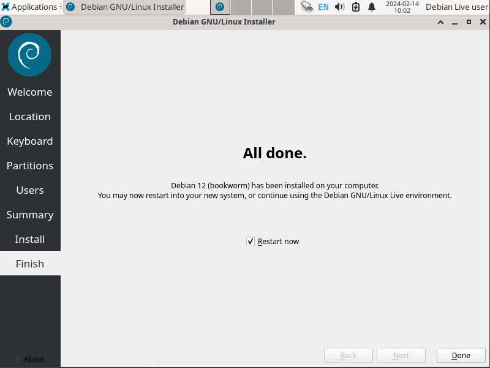

Virtuaalikone käynnistyi uudestaan ja avasi sisäänkirjautumis kohdan. Kirjauduin sisään aiemmin täyttämilläni tiedoilla.  

Sain virtuaalikoneen kuntoon klo 10:09.

### Apache weppipalvelin

Klo 11:13 avasin virtuaalikoneen terminalin ja asensin sinne apachen seuraavilla komennoilla:

    $ sudo apt-get update
    $ sudo apt-get -y install apache2

Testasin toimivuuden selaimen osoitteesta http://localhost. Hyvin toimi.  

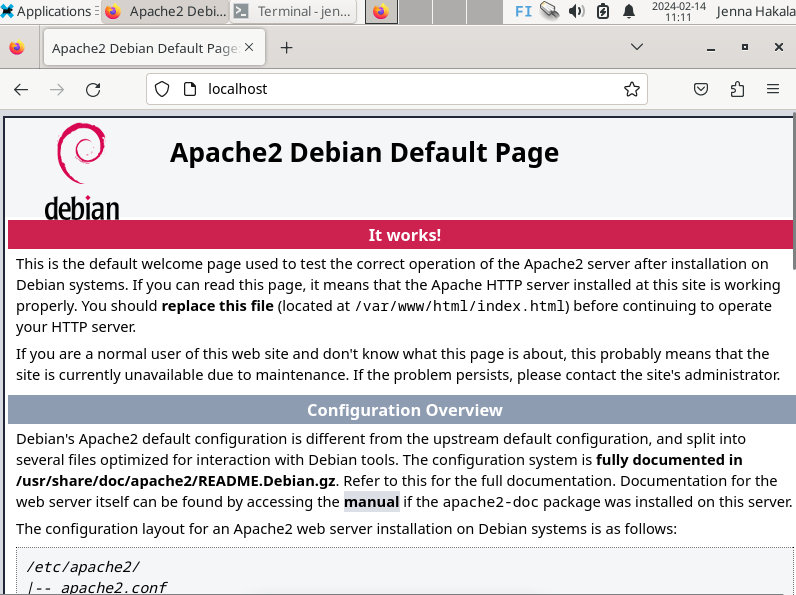

Asensin SSH-etähallintapalvelimen Googlesta löydettyjen [ohjeitten](https://www.cyberciti.biz/faq/ubuntu-linux-install-openssh-server/) mukaan. Syötin komennot:  

    $ sudo apt-get install -y openssh-server
    $ sudo systemctl enable ssh
    $ sudo systemctl start ssh

Jatkoin seuraavana päivänä 15.2.2024 klo 11:28 jatkoin weppipalvelimen etusivun teolla. Syötin komennon `$ sudoedit /etc/apache2/sites-available/kissa.com.conf`, jonka jälkeen kirjasin `<VirtualHost>` tiedot.  

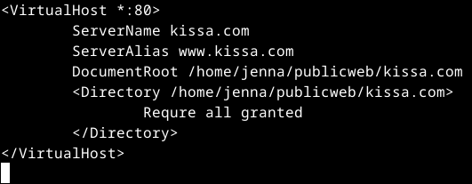

Tekstieditorin sulkemisen jälkeen syötin vielä `$ sudo a2ensite kissa.com` ja otin muutokset käyttöön `$ sudo systemctl restart apache2`.  
Tämä ei kuitenkaan onnistunut ihan odotusten mukaisesti, vaan `$ sudo systemctl restart apache2` -komennosta sain virheilmoituksen.

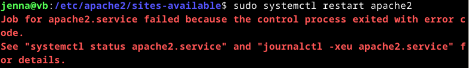

Kävinn kummatkin suositellut komennot läpi, mutta en niistä saanut ihan ymmärrystä tähän, joten päätin kokeilla `$ sudo apachectl configtest` ja sieltä huomasin, että `<VirtualHost>` -tiedostossa oli kirjoitusvirhe, jos toinenkin. Korjasin nämä ja tallensin tiedoston.

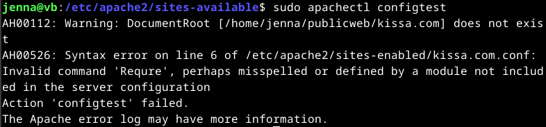
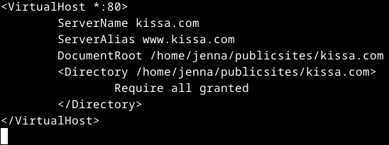

Kirjotusvirheen korjaamisen jälkeen komento `$ sudo systemctl restart apache2` meni läpi.   

Tämän jälkeen loin polun hakemistolle komennolla `$ mkdir -p /home/jenna/publicsites/kissa.com`.  
Komennolla `$ echo kissa > /home/jenna/publicsites/kissa.com/index.html` loin hakemistoon HTML-tiedoston ja testisanan.  
Poistin samalla default-sivun käytöstä komennolla `$ sudo a2dissite 000-default.conf` ja hyväksyin muutokset.  
Kävin selaimessa testaamassa ja hyvin toimii.  

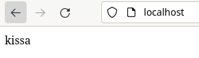

Tässä vaiheessa asensin micro-editorin syöttämällä komennot: 

    $ sudo apt-get update
    $ sudo apt-get -y install micro

Kävin myös muokkaamassa `index.html` -tiedoston validiksi HTML-sivuksi.

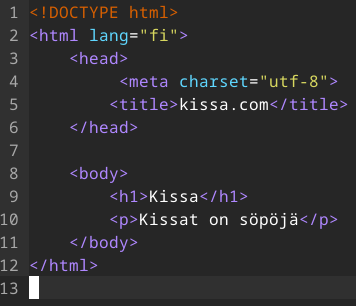  
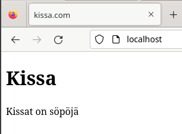

Sain tämän tehtyä klo 12:40.

### Julkinen SSH-avain

Aloitin tehtävän klo 13:26 käynnistämällä SSH komennolla `$ sudo systemctl start ssh`. En ole varma, olisiko tätä tarvinnut tehdä erikseen.  
Syötin komennon `$ ssh jenna@localhost`, minkä jälkeen kysyttiin haluanko jatkaa, vastasin kyllä. Tämän jälkeen pyydettiin salasanaa, minkä annoin.

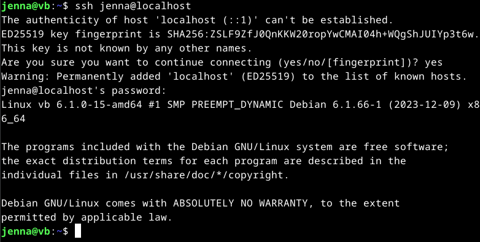

Seuraavaksi syötin komennon `$ ssh-keygen` ja painoin jokaisessa kohdassa vain Enteriä.

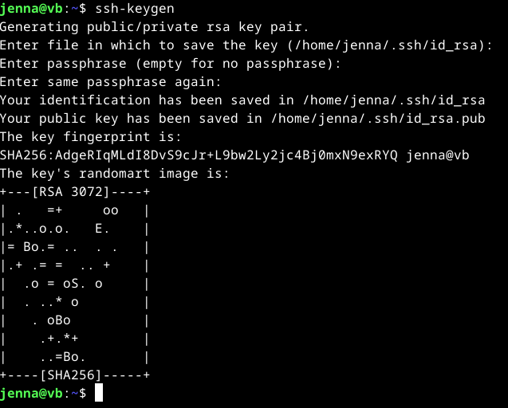

Sitten oli komennon `$ ssh-copy-id jenna@localhost` aika. 

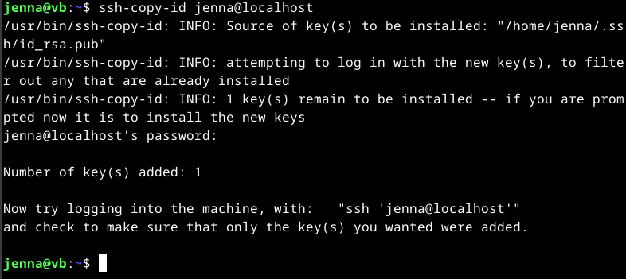

Tämän jälkeen testasin kirjautua sisään komennolla `$ ssh jenna@localhost` ja tämä toimi, sillä salasanaa ei kysytty.

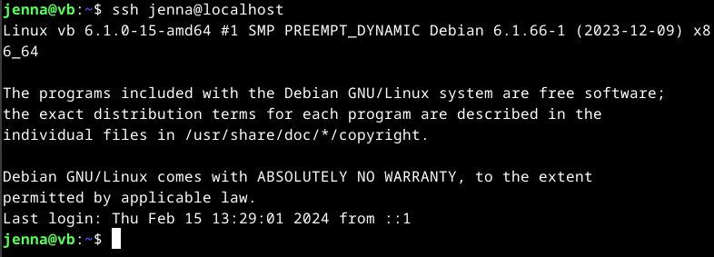

### Digging host

Aloitin klo 13:50 asentamalla `dnsutils` komennolla `$ sudo apt-get -y install dnsutils`, jotta host ja dig komennot toimisivat.  

Testasin komentoa `$ host jennamaria.live` ja sain sieltä domainin ip-osoitteen.  
Laitoin myös komennon  `$ host -a jennamaria.live`, jolloin ruudulle ilmestyi hieman enemmän DNS-tietoja domainista.  
Analysoin tuloksia ChatGPT:n avualla, sillä en kunnolla löytänyt muualta selityksiä.

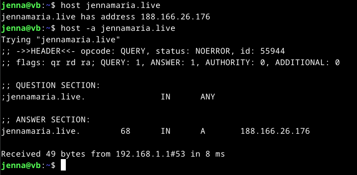

**HEADER**
**opcode** kertoo kyselyn tyypin, mikä tässä on QUERY eli kysely  
**status** kertoo tilan, NOERROR eli ei virheitä  
**id** kertoo tunnisteen, 55944  
**flags** qr (response), rd (recursion deired), ra (recursion available)  

**QUESTION SECTION**  
**jennamaria.live. IN ANY** kertoo, että kysely koskee kaikkia 'ANY' tietueita 'IN' verkkotunnuksessa 'jennamaria.live'  

**ANSWER SECTION**  
**jennamaria.live** A-tietueen (IPv4-osoite) arvo on 188.166.26.176  
**68** on TTL (Time to Live)  
**IN** on luokka.  

Lopussa kerrotaan vielä, että vastaus on saatu 8 millisekunnissa, 49 tavun kokoisena DNS-palvelimelta, joka sijaitsee IP-osoitteessa 192.168.1.1 sekä portissa 53.  

Testasin myös komentoa `$ dig jennamaria.live`

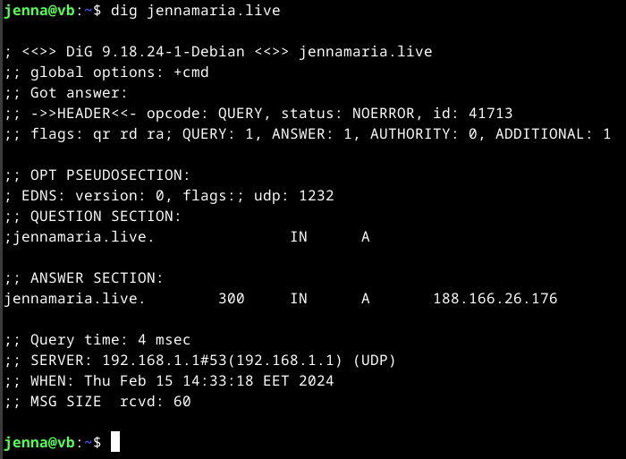

Komento antoi paljon samoja tietoja, kuin `$ host -a jennamaria.live`. 

**+cmd**  on oletusasetus ja tarkoittaa, että dig toimii komentorivikäyttöliittymän kautta, kuten tavallinen komentoriviohjelma
**EDNS** Extended DNS (DNS-laajennus) kertoo, että pyyntö käyttää EDNS-protokollaaja  
**UDP** koko on 1232 tavua

**ANSWER SECTION** kohdassa huomasin, että TTL on 300, mikä oli se sekunti määrä, mitä valitsin Name.comissa

**Query time** vastausaika, tässä tapauksessa 4 millisekuntia
**SERVER** kysely on tehty tässä IP-osoitteessa ja portissa
**WHEN** milloin kysely tehtiin
**MSG SIZE rcvd** vastauksen kokonaismäärä tavuina

Testasin tutkia name.com -sivustoa komennolla `$ dig name.com` ja sain suhteellisen samanlaiset vastaukset kuin omastani.  
Sivun koko (upd) on paljon suurempi, TTL pienempi ja vastauksen tavumäärä oli hieman korkeampi.

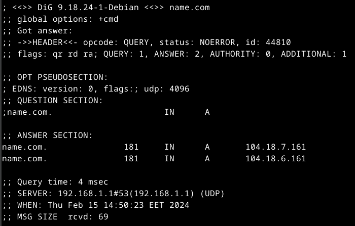

 ## Lähteet
Karvinen, T. 13.2.2024. Oppitunti. Linux Palvelimet.  
Karvinen, T. 2024. Tehtävänanto. https://terokarvinen.com/2024/linux-palvelimet-2024-alkukevat/#h5-koko-juttu.  
OpenAI. ChatGPT. Versio 3.5. 2024. https://chat.openai.com/chat.  
Cyberciti. nixCraft. 30.10.2023. Ubuntu Linux install OpenSSH server. https://www.cyberciti.biz/faq/ubuntu-linux-install-openssh-server/.  
Medium. Serversupportz. 22.2.2021. How to install nslookup, dig, host commands in Linux. https://tranzservrsupprtz123.medium.com/how-to-install-nslookup-dig-host-commands-in-linux-3510dac46d99.  
