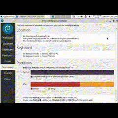

# Koko juttu

## Tehtäviä

Käytin tehtävää tehdessä avukseni aikaisempia [raporttejani](https://github.com/haksutin/linux-server) sekä [ChatGPT](https://chat.openai.com/) henkisenä tukena.

### Käyttöympäristö

Intel Core i7-13700K, 3.40 GHz, 16 Core Processor   
RAM: 32 Gt   
Windows 11 Pro, versio 23H2  
Debian 12 Bookworm

### Virtuaalikoneen asennus

Aloitin virtuaalikoneen asennuksen 14.2.2024 klo 9:08.  
Avasin Oracle VM VirtualBoxin ja klikkasin kohtaa "New", minkä jälkeen avautui "Create Virtual Machine" -ikkuna.  
Vaihdoin näkymän alareunasta Expert modeen ja täytin tarvittavat tiedot sekä korjasin aiemmalla kerralla tekemäni virheen klikkaamalla "Skip Unattended Install".  

Siirryin kohtaan "Hardware" ja lisäsin muistia ja prosessoreita.

Seuraavaksi siirryin kohtaan "Hard Disk" ja muokkasin kohtaa "Hard Disk File Location and Size" suuremmaksi.  
Tämän jälkeen painoin "Finish" -nappia.  

Siirryin VirtualBox Manageriin ja valitsin "Settings", josta siirryin "Storage" -kohtaan.  
Klikkasin CD-levyä, jonka kohdalla lukee "Empty". Tämän jälkeen oikealle reunalle avautui "Attributes", jossa painoin CD-levyä ja valitsin "debian-live-12.4.0-amd64-xfce-iso" -tiedoston. Tämän jälkeen hyväksyin muutokset painamalla "OK" -näppäintä.  

 

Tämän jälkeen käynnistin virtuaalikonen. Alussa avautui "Boot menu", josta valitsin "Live system (amd64)" painamalla Enter.  
Heti alkuun testasin selaimen toimivuuden.  

Klikkasin työpöydällä olevaa "Install Debian" -kuvaketta ja ruudulle pomppasi huomio ruutu, jossa kysytään haluanko jatkaa, klikkasin "Launch Anyway".  

Debian installerissa tein seuraavat valinnat:

- Welcome: `American English`
- Location: Region: `Europe` ja Zone: `Helsinki`, valinnan voi myös tehdä klikkaamalla Suomea kartalta
- Keyboard:  Keyboard Model: `Generic 105-key PC` sekä `Finnish` ja `Default`
- Partitions: `Erase disk`

Users kohdassa täytin kaikki kohdat.  

Summary kohdassa tarkistin vielä, että valinnat on oikein ja hyväksyin ne klikkamalla "Install" -nappia. Nappi ei ollut näkyvissä, mutta suurentamalla ruutua oikeasta yläreunasta se tulee näkyville.  

Tämän jälkeen tietoja päiviteltiin ja latauksen jälkeen ruutu siirtyi "Finish" -kohtaan, jossa oli teksti "All done.". Jätin "Restart now" -täpän päälle ja klikkasin "Done".  

Virtuaalikone käynnistyi uudestaan ja avasi sisäänkirjautumis kohdan. Kirjauduin sisään aiemmin täyttämilläni tiedoilla.  

Sain virtuaalikoneen kuntoon klo 10:09.

### Apache weppipalvelin

Klo 11:13 avasin virtuaalikoneen terminalin ja asensin sinne apachen seuraavilla komennoilla:

    $ sudo apt-get update
    $ sudo apt-get -y install apache2

Testasin toimivuuden selaimen osoitteesta http://localhost. Hyvin toimi.  

Asensin SSH-etähallintapalvelimen Googlesta löydettyjen [ohjeitten](https://www.cyberciti.biz/faq/ubuntu-linux-install-openssh-server/) mukaan. Syötin komennot:  

    $ sudo apt-get install -y openssh-server
    $ sudo systemctl enable ssh
    $ sudo systemctl start ssh

    

 ## Lähteet
 Cyberciti. nixCraft. 30.10.2023. Ubuntu Linux install OpenSSH server. https://www.cyberciti.biz/faq/ubuntu-linux-install-openssh-server/.
