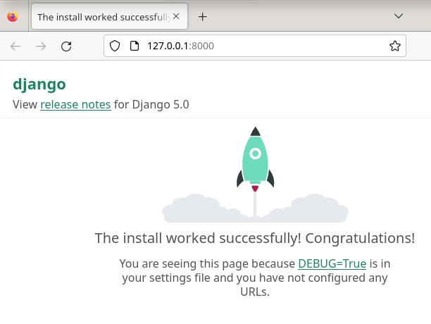
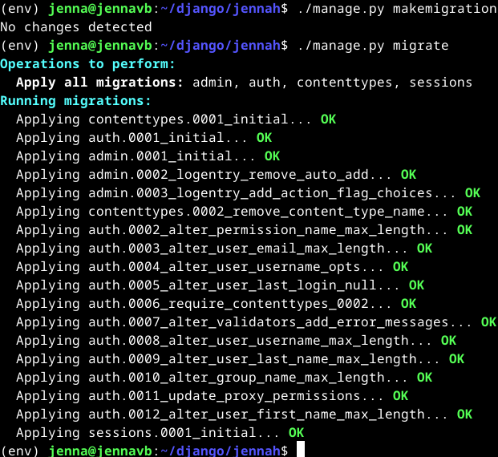
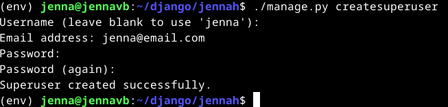
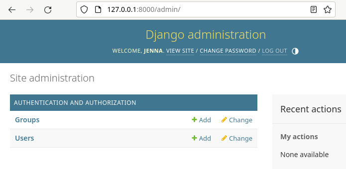
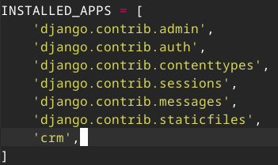
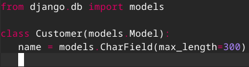
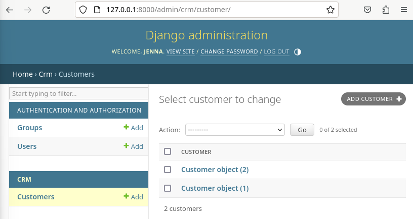
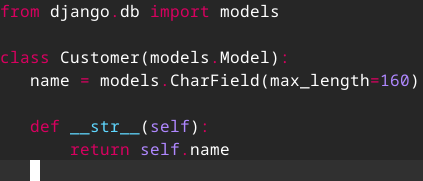
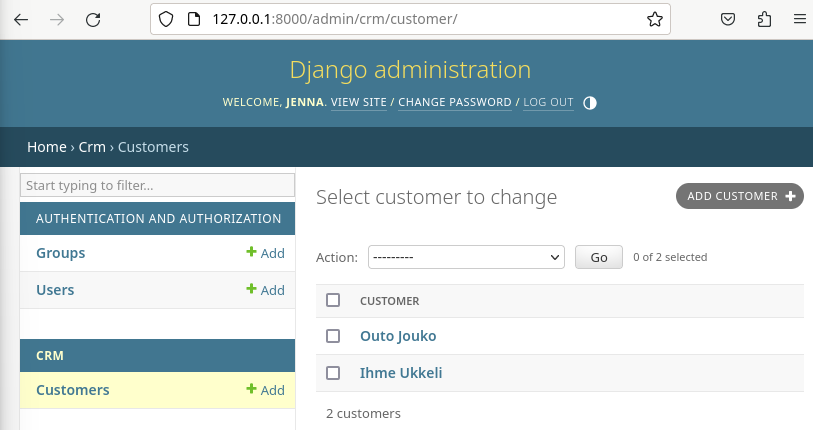

# DJ Ango

## Artikkelit
### [Deploy Django 4 - Production Install](https://terokarvinen.com/2022/deploy-django/)
- `<VirtualHost>`-tiedostoon Document rootin tilalle rivi `Alias /static/ /home/tero/publicwsgi/teroco/static/`
- lisätään `/static/` kotihakemiston perälle
- Konfiguraatioiden testaus ennen käyttöönottoa `$ /sbin/apache2ctl configtest`
- `requirements.txt`-tiedostoon lisätään 'django'
- `$ pip install -r requirements.txt`
- `$ virtualenv -p python3 --system-site-packages env`
- `$ which pip` tarkistaa tiedoston sijainnin
- `$ sudo apt-get -y install libapache2-mod-wsgi-py3`
- Apachen tarkistukseen komento `$ curl -sI localhost|grep Server`
- lokien selaus `$ sudo tail /var/log/apache/error.log`

### [Django 4 Instant Customer Database Tutorial](https://terokarvinen.com/2022/django-instant-crm-tutorial/)
- `$ virtualenv --system-site-packages -p python3 env/`
- Virtuaalinen ympäristö käyttöön `$ source env/bin/activate`
- `requirements.txt`-tiedostoon lisätään 'django'
- Projektin aloitus `$ django-admin startproject teroco`
- `$ ./manage.py makemigrations` ja `$ ./manage.py migrate`
- Käyttäjän luonti `$ ./manage.py createsuperuser`
- `$ ./manage.py startapp crm` luo uuden django-sovelluksen sekä kansion 'crm'

## Tehtäviä

Käytin tehtävissä avukseni Tero Karvisen laatimia ohjeita [Django 4 Instant Customer Database Tutorial](https://terokarvinen.com/2022/django-instant-crm-tutorial/) ja [Deploy Django 4 - Production Install](https://terokarvinen.com/2022/deploy-django/), sekä [ChatGPT](https://chat.openai.com/) henkisenä tukena.

### Käyttöympäristö

Intel Core i7-13700K, 3.40 GHz, 16 Core Processor   
RAM: 32 Gt   
Windows 11 Pro, versio 23H2  
Debian 12 Bookworm

### Esimerkkiohjelma Djangolla
Aloitettiin kehitysympäristön asennusta jo tunnin aikana.  
Heti alkuun hain päivitykset sekä asensin virtualenv-työkalun komennoilla: 

    $ sudo apt-get update
    $ sudo apt-get install virtualenv

Tämän jälkeen loin kansion komennolla `$ mkdir django` ja siirryin kansioon `$ cd django/`.  
Seuraavaksi loin virtuaaliympäristön Python 3:lla ja aktivoin sen komennoilla:

    $ virtualenv --system-site-packages -p python3 env/
    $ source env/bin/activate

Syötin komennon `$ micro requirements.txt` ja lisäsin tiedostoon sanan 'django'. Tässä kohtaa piti olla tarkkana, että sana on oikein kirjoitettu.  
Komento `$ pip install -r requirements.txt` asentaa Djangon `requirements.txt`-tiedoston perusteella.  
Loin uuden projektin komennolla `$ django-admin startproject jennah`.  
Tämän jälkeen siirryin kansioon `$ cd jennah/` ja käynnistin Djangon kehityspalvelimen `$  ./manage.py runserver`. 
Testasin toimivuuden osoitteessa http://127.0.0.1:8000/ ja näytti toimivan.

Jatkoin 28.2.2024 klo 8:00 päivittämällä tietokannat komennoilla:

    $ ./manage.py makemigrations
    $ ./manage.py migrate

Käyttäjän luonnin aloitin asentamalla työkakalun, mikä generoi satunnaisia salasanoja. Loin työkaluklla 20 merkkisen salasanan.

    $ sudo apt-get install pwgen
    $ pwgen -s 20 1

Loin käyttäjän komennolla `$ ./manage.py createsuperuser`.

Kävin testaamassa käyttäjää osoitteessa http://127.0.0.1:8000/admin/. Pääsin sisään.

Tässä kohtaan piti vissiin tehdä toinen käyttäjä, joten tein uuden nimeltä jensku.

Aloitin asiakastietokannan luomisen komennolla `$ ./manage.py startapp crm`.  
 `settings.py`-tiedoston löytäminen oli hieman hankalaa, sillä komento `$ micro jennah/settings.py` avasi vain tyhjän tiedoston. Löysin valmiin tiedoston kuitenkin hakemistosta `/home/jenna/django/jennah/jennah`.

Siirryin `crm` hakemistoon ja muokkasin tiedostoa `models.py`.  
 

Syötin komennot:

    $ ./manage.py makemigrations
    $ ./manage.py migrate

Tämnän jälkeen syötin komennon `$ micro crm/admin.py` ja muokkasin tiedostoa ohjeiden mukaan.

Siirryin testaamaan taas osoitteeseen http://127.0.0.1:8000/admin/. Kirjauduin sisään ja lisäsin kaksi asiakasta.

Jotta sain nimet listalla näkyviin syötin taas komennon `$ micro crm/models.py` ja muokkasin tiedostoa lisää.  
Nyt nimet on näkyvissä.

Sain tämän valmiiksi klo 9:02.

### Djangon tuotantotyyppinen asennus

## Lähteet
Karvinen, T. 27.2.2024. Oppitunti. Linux Palvelimet.  
Karvinen, T. 2024. Tehtävänanto. https://terokarvinen.com/2024/linux-palvelimet-2024-alkukevat/#h6-dj-ango.  
Karvinen, T. 13.2.2022. Deploy Django 4 - Production Install. https://terokarvinen.com/2022/deploy-django/.   
Karvinen, T. 13.2.2022. Django 4 Instant Customer Database Tutorial. https://terokarvinen.com/2022/django-instant-crm-tutorial/.  
OpenAI. ChatGPT. Versio 3.5. 2024. https://chat.openai.com/chat.   
