# Maalisuora

## Tehtäviä

Käytin tehtävää tehdessä avukseni aikaisempia [raporttejani](https://github.com/haksutin/linux-server), Tero Karvisen laatimia [ohjeita](https://terokarvinen.com/) sekä [ChatGPT](https://chat.openai.com/) henkisenä tukena.

### Käyttöympäristö

Intel Core i7-13700K, 3.40 GHz, 16 Core Processor   
RAM: 32 Gt   
Windows 11 Pro, versio 23H2  
Debian 12 Bookworm

### Hei maailma

Aloitin 6.3.2024 klo 11:40 siirtymällä kotihakemistossa aiemmin luomaani `bin`-kansioon. Loin sinne tiedoston komennolla `$ micro hei.py`.  
Lisäsin tiedoston alkuun 'shebang'-merkinnän, mikä määrittää, mitä ohjelmaa käytetään. Tässä tapauksessa se on `python3`.

Tämän jälkeen syötin komennon`$ python3 hei.py` ja 'Hello, world!' tulostui.

### Uusi komento

Klo 11:55 jatkoin seuraavaan osioon. Loin tiedoston `lehmu.sh` aikaisemmassa kohdassa käytettyyn kansioon.  
Lisäsin tiedostoon sisältöä.  

Annoin tiedostolle käyttöoikeuksia komennolla `$ chmod ugo+rx lehmu.sh`.  
Koitin myös, että komento toimii syöttämällä komennon `$ ./lehmu.sh`. 

Siirsin tiedoston järjestelmän yleiseen kansioon komennolla `$ sudo cp lehmu.sh /usr/local/bin/`. Tämän avulla se toimii muillakin käyttäjillä. 

Tein tarkistukseksi uuden käyttäjän komennolla `$ sudo adduser kenna`, syötin salasanan ja nimen.  
Testasin tällä käyttäjällä komentoa ja toimi. 

Sain tehtävän tehtyä klo 12:30.  

### Vanha laboratorioharjoitus
Aloitin tehtävän klo 12:45.
Löysin Teron sivuilta [laboratorioharjoituksen](https://terokarvinen.com/2023/linux-palvelimet-2023-arvioitava-laboratorioharjoitus/?fromSearch=laboratorioharjoitus) keväältä 2023. Päätin lähteä testaamaan sitä. 

#### Hey

Siirryin kotihakemistossa `bin`-kansioon. Loin tiedoston `hey`, lisäsin sisältöä ja testasin toimivuuden.  

Annoin tiedostolle käyttöoikeuksia komennolla `$ chmod ugo+rx hey` ja testasin komentoa `$ ./hey` - toimii.  
Siirsin tiedoston järjestelmän yleiseen kansioon `$ sudo cp hey /usr/local/bin/`.  
Siirryin `cd`-komennolla kotihakemistoon ja testasin komentoa syöttämällä `hey`. 

Testasin saman vielä toisella käyttäjällä, toimii vieläkin. Käytin käyttäjän vaihtoon komentoa `su - kenna`.  

#### Staattisesti sinun

Apache olikin valmiiksi jo asennettuna.
Loin Erkille käyttäjän komennolla `$ sudo adduser erkki sudo` ja annoin hänelle sudo-oikeudet `$ sudo adduser erkki sudo`.  
Heti alkuun siirryin hakemistoon `/etc/apache2/sites-enabled/` ja poistin sieltä `conf`-tiedoston pois käytöstä komennolla `$ sudo a2dissite jennah.conf`. Siirryin hakemistoon `/etc/apache2/sites-available/` ja tein sinne `VirtualHost`-tiedoston komennolla `$ micro erkki.conf`.  

 

Seuraavaksi laitoin `erkki.conf`-sivun päälle ja hyväkysin muutokset komennoilla:  

    $ sudo a2ensite erkki.conf
    $ sudo systemctl restart apache2

Tämän jälkeen siirryin kotihakemistoon ja syötin komennon `$ echo testi > /home/erkki/publicsites/erkki.com/index.html`. Tämän avulla `erkki.com`-kansioon luotiin tiedosto nimeltä `index.html` ja sana 'testi' sen sisään.  

Selaimesta en saanut localhostia auki, joten tarkastelin lokitietoja komennolla `$ sudo tail /var/log/apache2/error.log`. Huomasin sieltä, että hakemistoon `/home/erkki/publicsites` ei ole oikeuksia.  
ChatGPT:n avulla sain selvitettyä, mitkä komennot tulee suorittaa, että saan oikeudet oikein. Syötin seuraavat komennot:  

    $ sudo chmod +x /home/erkki`
    $ sudo chmod +x /home/erkki/publicsites`

Tämän jälkeen http://localhost toimi. 

 
 

#### Salattua hallintaa

SSH on jo valmiiksi asennettuna.  
Loin uuden käyttäjän komennolla `$ sudo adduser jennatest`.  

Seuraavaksi yhdistin SSH-yhteydellä käyttäjän jennatest localhostiin `$ ssh jennatest@localhost`.  
En ole ihan täysin varma, miksi tuli teksti ''localhost (::1)' can't be established', mutta meni kuitenkin läpi.   

 

Seuraavaksi SSH-avaimen komennolla `$ ssh-keygen`. Painoin kaikissa kohdissa enteriä - tässä luotiin myös hakemisto `/home/jennatest/.ssh` avaimelle.  

 

Komennolla `$ ssh-copy-id jennatest@localhost` kopioi avaimen etäkoneille. 

 

Sitten oliki kokeilun aika. Testasin kirjautua etäkoneelle `$ ssh jennatest@localhost` ja tämä onnistuikin ilman salasanaa.  

Seuraavaksi oli portin vaihtaminen. Löysin tähän [ohjeen](https://www.ionos.com/help/server-cloud-infrastructure/getting-started/important-security-information-for-your-server/changing-the-default-ssh-port/) Googlen kautta. Syötin komennon `$ sudoedit /etc/ssh/sshd_config`, mutta käyttäjällä jennatest ei ole sudo-oikeuksia.  
Siirryin takaisin pääkäyttäjälle ja lisäsin jennatest sudo-oikeudet komennolla `$ sudo adduser jennatest sudo`.  
Syöin komennon `$ sudoedit /etc/ssh/sshd_config` uudestaan ja pääsin muokkaamaan portin kohdalle 1337.  

Tämän jälkeen käynnistin ssh uudestaan komennolla `$ sudo systemctl restart ssh`.  

Lopettelin osiota klo 16:15.

#### Djangon lahjat

Jatkoin to 7.3.2024 klo 9:30 syöttämällä komennon `$ sudo apt-get update`. Huomasin, että `virtualenv` olikin jo asennettuna koneelle, joten loin `virtualenv`-virtuaaliympäristön ja aktivoin sen seuraavilla komennoilla:  

     $ virtualenv --system-site-packages -p python3 env/
     $ source env/bin/activate

Komentojen jälkeen komentorivin alkuun tuli teksti `(env)`.  

Tarkistin vielä `pip` toimii virtuaaliympäristön kautta komennolla `$ which pip`.  

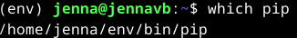

Loin kansion nimeltä `testd` ja loin sen sisään `requirements.txt`-tiedoston, johon kirjoitin sanan 'django'. Sekä asensin djangon tekstitiedoston perusteella.  
Tämän jälkeen loin uuden django-projektin.  

    $ echo django > requirements.txt
    $ pip install -r requirements.txt
    $ django-admin startproject testi

Siirryin `testi`-kansioon ja käynnistin djangon kehityspalvelimen `$ ./manage.py runserver`. Komento atoi punottavaa tekstiä, mutta kuuluu vissiin asiaan.  

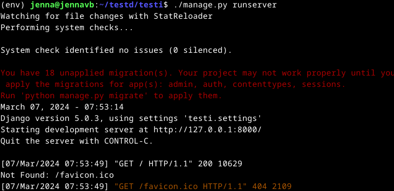

Testasin tämän toimivuuden selaimen osoitteessa http://127.0.0.1:8000/.  

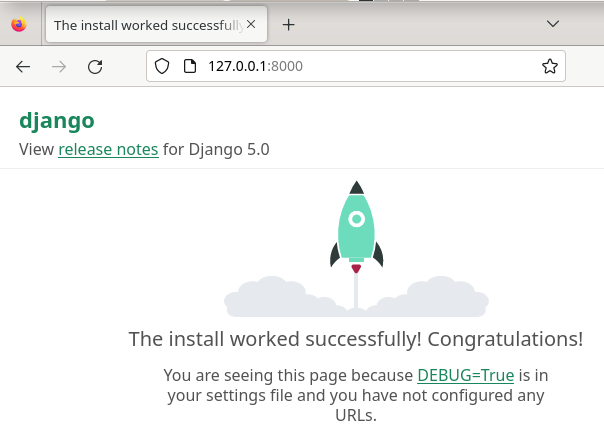

Seuraavaksi muokataan osoiteesta `http://127.0.0.1:8000/` `127.0.0.1:8000/admin/`. Syötin seuraavat komennot päivittääkseni tietokantoja:  

    $ ./manage.py makemigrations
    $ ./manage.py migrate

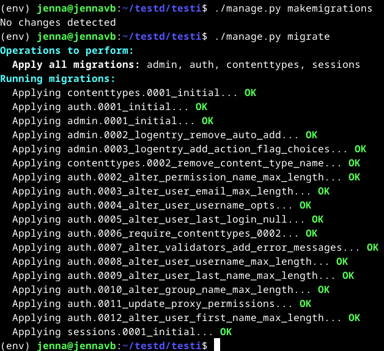

Selain ei tietenkään lähtenyt toimimaan alkuun, sillä en ollut asentanut `env` oikeassa kansiossa.  
Siirryin takaisin hakemistoon `/home/jenna/testd` ja syötin seuraavat komennot uudestaan:  

    $ virtualenv --system-site-packages -p python3 env/
    $ source env/bin/activate
    $ which pip
    $ pip install -r requirements.txt
    $ cd testi/
    $ ./manage.py runserver

Nyt toimii.  

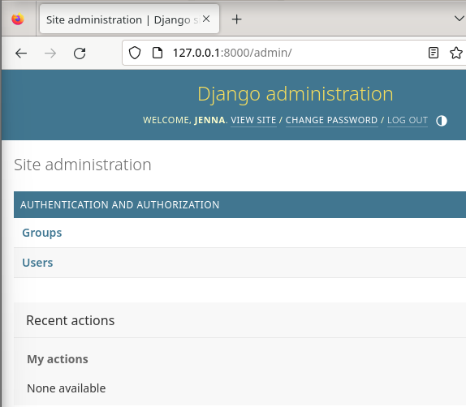

Loin käyttäjän Erkille käyttäjän komennolla `$./manage.py createsuperuser`.  

Aloitin tietokannan luomisen komennolla `$ ./manage.py startapp crm`.  

Siirryin hakemistoon `/home/jenna/testd/testi/testi/` ja avasin tiedoston `settings.py`. Lisäsin 'INSTALLED_APPS' kohdalle 'crm'.  

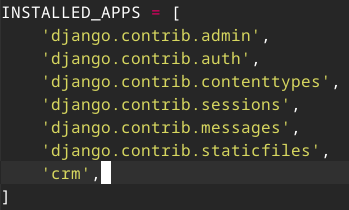

Siirryin `crm`-kansioon ja avasin tiedoston `models.py`.  
Lisäsin taulun `Donations` ja samalla lisäsin koodi-pätkän, millä saa nimet yms näkyviin.  

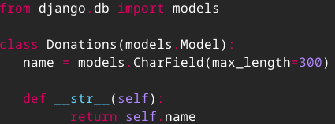

Seuraavaksi päivitin tietokannat:  

    $ ./manage.py makemigrations
    $ ./manage.py migrate

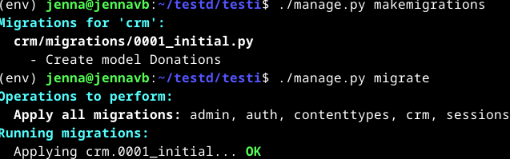

Syötin komennon `$ micro crm/admin.py` ja lisäsin sinne tekstiä, jotta tietokanta näkyisi selaimessa.  

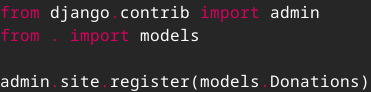

Tämän jälkeen syötin komennon `$ ./manage.py runserver` ja testasin sitä selaimessa.  
Toimii ja lisäsin kaksi esinettä tauluun.  

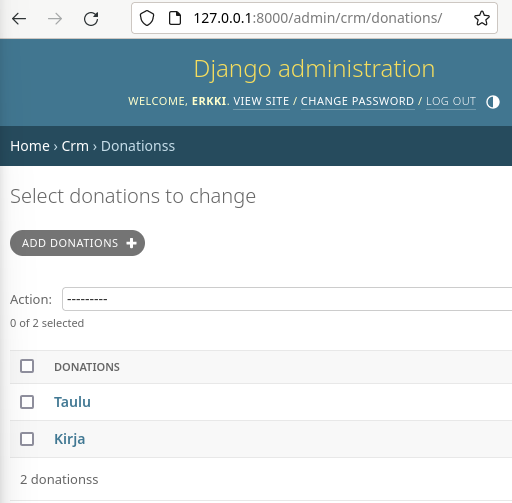

Sain osion valmiiksi klo 11:45.

### Virtuaalikoneen asennus

Asensin uuden virtuaalikoneen arvioitavaa labraa varten. Aloitin klo 12:00 avaamalla Oracle VM VirtualBoxin ja klikkasin `New`.  
Tarkistin, että `Expert Mode` on päällä ja täytin seuraavat tiedot.  

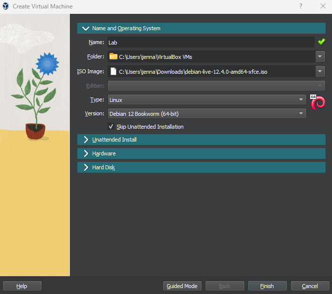

Siirryin kohtaan `Hardware` ja lisäsin muistia ja prosessoreita.  

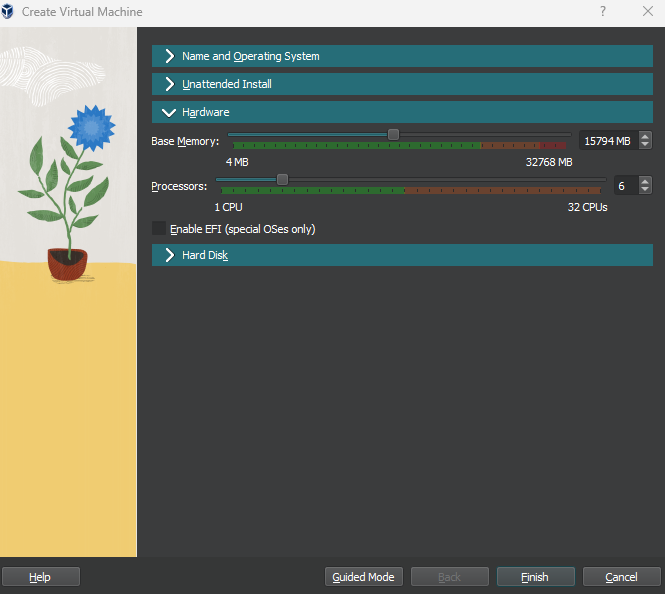

Seuraavaksi siirryin kohtaan `Hard Disk` ja muokkasin `Hard Disk File Location and Size` suuremmaksi.  
Tämän jälkeen klikkasin `Finish`.

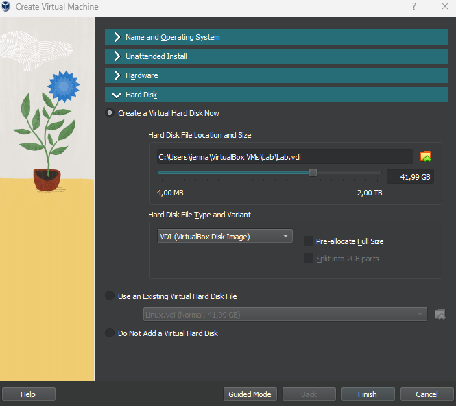

Siirryin VirtualBox Manageriin ja valitsin `Settings`, josta siirryin vielä `Storage`-kohtaan.
Klikkasin CD-levyä, jonka kohdalla lukee 'Empty'. Tämän jälkeen oikealle sivulle avautui 'Attributes', jossa painoin CD-levyä ja valitsin `debian-live-12.4.0-amd64-xfce-iso` -tiedoston.
Tämän jälkeen hyväksyin muutokset klikkaamalla `OK`.

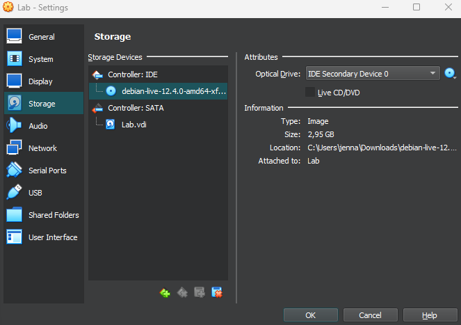

Virtuaalikoneen avaamisessa aukesi 'Bootmenu', jossa painoin vain enteriä.  
Klikkasin työpöydällä olevaa `Install Debian`-kuvaketta. Ruudulle pompahti 'Untrusted application launcher', jossa klikkasin `Launch Anyway`.  

Tein Debian Installerissa seuraavat valinnat:  

- Welcome: `American English`
- Location: Region: `Europe` ja Zone: `Helsinki`, valinnan voi myös tehdä klikkaamalla Suomea kartalta
- Keyboard:  Keyboard Model: `Generic 105-key PC` sekä `Finnish` ja `Default`
- Partitions: `Erase disk`
- Users: täytin omat tiedot

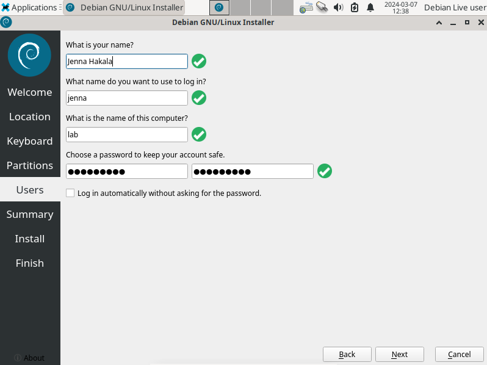

Summary -kohdassa tarkistin tiedot ja klikkasin `Install`.  

Tietojen pävittelyssä meni hetki, mutta sen jälkeen ruudulle ilmestyi 'All done'. Jätin myös 'Restart now' -täpän päälle ja klikkasin `Done`.  

Virtuaalikone käynnistyi uudestaan ja avasin terminalin.  
Aloitin hakemalla päivitykset ja päivittämällä myös ohjelmistot:

    $ sudo apt-get update
    $ sudo apt-get dist-upgrade

Asensin koneelle myös tulimuurin, avasin portille 80 reiän ja käynnistin palomuurin:

    $ sudo apt-get install ufw
    $ sudo ufw allow 80/tcp
    $ sudo ufw enable

Tarkistin vielä palomuurin säännöt komennolla `$ sudo ufw status`.  

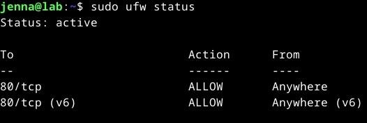

Sain kohdan valmiiksi 13:05.

## Lähteet

Karvinen, T. 5.3.2024. Oppitunti. Linux Palvelimet.  
Karvinen, T. 2024. Tehtävänanto. https://terokarvinen.com/2024/linux-palvelimet-2024-alkukevat/#h7-maalisuora.  
Karvinen, T. 17.3.2023. Final Lab for Linux Palvelimet 2023. https://terokarvinen.com/2023/linux-palvelimet-2023-arvioitava-laboratorioharjoitus/?fromSearch=laboratorioharjoitus.  
OpenAI. ChatGPT. Versio 3.5. 2024. https://chat.openai.com/chat.  
IONOS. s.a. Changing the Default SSH Port. https://www.ionos.com/help/server-cloud-infrastructure/getting-started/important-security-information-for-your-server/changing-the-default-ssh-port/.  
