# Maalisuora

## Tehtäviä

### Käyttöympäristö

Intel Core i7-13700K, 3.40 GHz, 16 Core Processor   
RAM: 32 Gt   
Windows 11 Pro, versio 23H2  
Debian 12 Bookworm

### Hei maailma

Aloitin 6.3.2024 klo 11:40 siirtymällä kotihakemistossa aiemmin luomaani `bin`-kansioon. Loin sinne tiedoston komennolla `$ micro hei.py`.  
Lisäsin tiedoston alkuun 'shebang'-merkinnän, mikä määrittää, mitä ohjelmaa käytetään. Tässä tapauksessa se on `python3`.

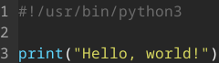

Tämän jälkeen syötin komennon`$ python3 hei.py` ja 'Hello, world!' tulostui.

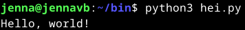

### Uusi komento

Klo 11:55 jatkoin seuraavaan osioon. Loin tiedoston `lehmu.sh` aikaisemmassa kohdassa käytettyyn kansioon.  
Lisäsin tiedostoon sisältöä.  

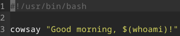

Annoin tiedostolle käyttöoikeuksia komennolla `$ chmod ugo+rx lehmu.sh`.  
Koitin myös, että komento toimii syöttämällä komennon `$ ./lehmu.sh`. 

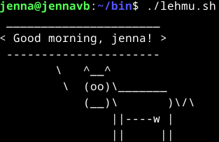

Siirsin tiedoston järjestelmän yleiseen kansioon komennolla `$ sudo cp lehmu.sh /usr/local/bin/`. Tämän avulla se toimii muillakin käyttäjillä. 

Tein tarkistukseksi uuden käyttäjän komennolla `$ sudo adduser kenna`, syötin salasanan ja nimen.  
Testasin tällä käyttäjällä komentoa ja toimi. 

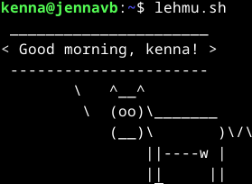

Sain tehtävän tehtyä klo 12:30.  

### Vanha laboratorioharjoitus
Aloitin tehtävän klo 12:45.
Löysin Teron sivuilta [laboratorioharjoituksen](https://terokarvinen.com/2023/linux-palvelimet-2023-arvioitava-laboratorioharjoitus/?fromSearch=laboratorioharjoitus) keväältä 2023. Päätin lähteä testaamaan sitä. 

#### Hey

Siirryin kotihakemistossa `bin`-kansioon. Loin tiedoston `hey`, lisäsin sisältöä ja testasin toimivuuden.  

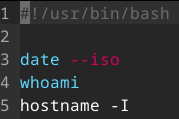
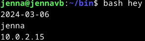

Annoin tiedostolle käyttöoikeuksia komennolla `$ chmod ugo+rx hey` ja testasin komentoa `$ ./hey` - toimii.  
Siirsin tiedoston järjestelmän yleiseen kansioon `$ sudo cp hey /usr/local/bin/`.  
Siirryin `cd`-komennolla kotihakemistoon ja testasin komentoa syöttämällä `hey`. 

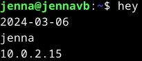

Testasin saman vielä toisella käyttäjällä, toimii vieläkin. Käytin käyttäjän vaihtoon komentoa `su - kenna`.  

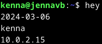

#### Staattisesti sinun

Apache olikin valmiiksi jo asennettuna.
Loin Erkille käyttäjän komennolla `$ sudo adduser erkki sudo` ja annoin hänelle sudo-oikeudet `$ sudo adduser erkki sudo`.  
Heti alkuun siirryin hakemistoon `/etc/apache2/sites-enabled/` ja poistin sieltä `conf`-tiedoston pois käytöstä komennolla `$ sudo a2dissite jennah.conf`. Siirryin hakemistoon `/etc/apache2/sites-available/` ja tein sinne `VirtualHost`-tiedoston komennolla `$ micro erkki.conf`.  

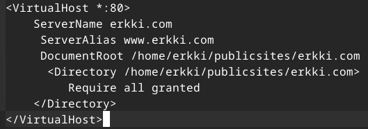 

Seuraavaksi laitoin `erkki.conf`-sivun päälle ja hyväkysin muutokset komennoilla:  

    $ sudo a2ensite erkki.conf
    $ sudo systemctl restart apache2

Tämän jälkeen siirryin kotihakemistoon ja syötin komennon `$ echo testi > /home/erkki/publicsites/erkki.com/index.html`. Tämän avulla `erkki.com`-kansioon luotiin tiedosto nimeltä `index.html` ja sana 'testi' sen sisään.  

Selaimesta en saanut localhostia auki, joten tarkastelin lokitietoja komennolla `$ sudo tail /var/log/apache2/error.log`. Huomasin sieltä, että hakemistoon `/home/erkki/publicsites` ei ole oikeuksia.  
ChatGPT:n avulla sain selvitettyä, mitkä komennot tulee suorittaa, että saan oikeudet oikein. Syötin seuraavat komennot:  

    $ sudo chmod +x /home/erkki`
    $ sudo chmod +x /home/erkki/publicsites`

Tämän jälkeen http://localhost toimi. 

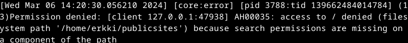 
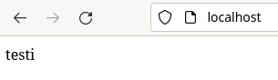 

#### Salattua hallintaa

SSH-on jo valmiiksi asennettuna.  
Loin uuden käyttäjän komennolla `$ sudo adduser jennatest`.  

Seuraavaksi yhdistin SSH-yhteydellä käyttäjän jennatest localhostiin `$ ssh jennatest@localhost`.  
En ole ihan täysin varma, miksi tuli teksti ''localhost (::1)' can't be established', mutta meni kuitenkin läpi.   

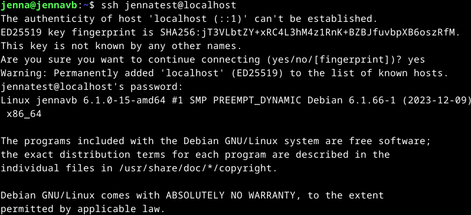 

Seuraavaksi SSH-avaimen komennolla `$ ssh-keygen`. Painoin kaikissa kohdissa enteriä - tässä luotiin myös hakemisto `/home/jennatest/.ssh` avaimelle.  

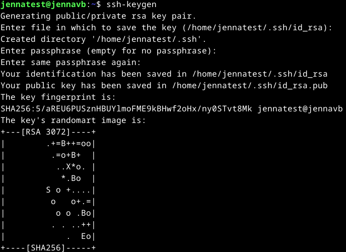 

Komennolla `$ ssh-copy-id jennatest@localhost` kopioi avaimen etäkoneille. 

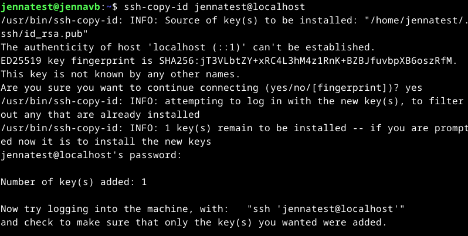 

Sitten oliki kokeilun aika. Testasin kirjautua etäkoneelle `$ ssh jennatest@localhost` ja tämä onnistuikin ilman salasanaa.  

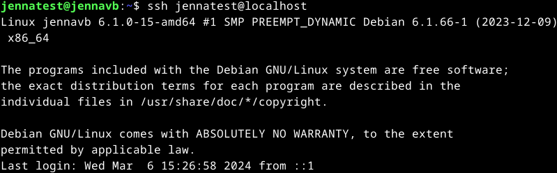

Seuraavaksi oli portin vaihtaminen. Löysin tähän [ohjeen](https://www.ionos.com/help/server-cloud-infrastructure/getting-started/important-security-information-for-your-server/changing-the-default-ssh-port/) Googlen kautta. Syötin komennon `$ sudoedit /etc/ssh/sshd_config`, mutta käyttäjällä jennatest ei ole sudo-oikeuksia.  
Siirryin takaisin pääkäyttäjälle ja lisäsin jennatest sudo-oikeudet komennolla `$ sudo adduser jennatest sudo`.  
Syöin komennon `$ sudoedit /etc/ssh/sshd_config` uudestaan ja pääsin muokkaamaan portin kohdalle 1337.  

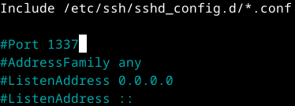

Tämän jälkeen käynnistin ssh uudestaan komennolla `$ sudo systemctl restart ssh`.  

#### Djangon lahjat

## Lähteet

Karvinen, T. 5.3.2024. Oppitunti. Linux Palvelimet.  
Karvinen, T. 2024. Tehtävänanto. https://terokarvinen.com/2024/linux-palvelimet-2024-alkukevat/#h7-maalisuora.  
OpenAI. ChatGPT. Versio 3.5. 2024. https://chat.openai.com/chat.  
IONOS. s.a. Changing the Default SSH Port. https://www.ionos.com/help/server-cloud-infrastructure/getting-started/important-security-information-for-your-server/changing-the-default-ssh-port/.  
